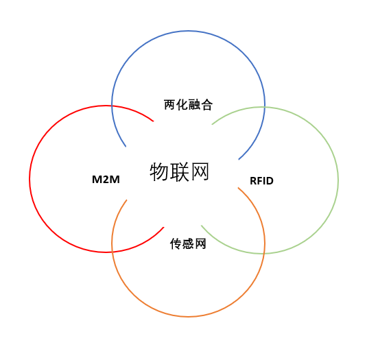
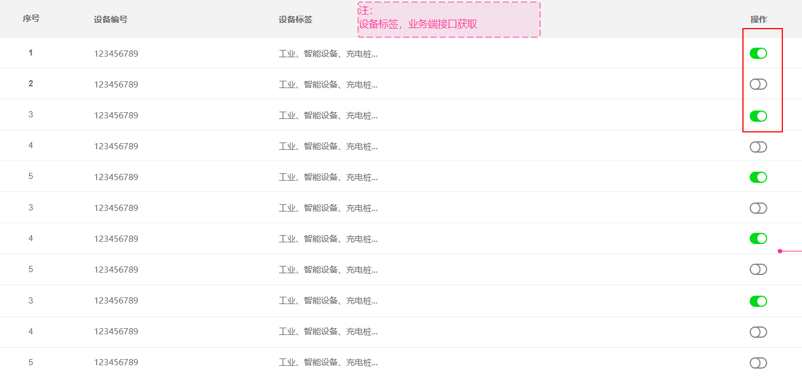

# 第1章 亿可控系统分析与设计

## 学习目标

- 了解物联网应用领域及发展现状
- 能够说出亿可控的核心功能
- 能够画出亿可控的系统架构图
- 能够完成亿可控环境的准备并了解亿可控的功能结构
- 完成设备管理相关功能的开发

## 1.物联网行业分析

### 1.1 什么是物联网

更多最新IT精品 www.cx1314.cn

**物联网**（英文：*Internet of Things*，缩写：*IoT*）起源于传媒领域，是信息科技产业的第三次革命。物联网是指通过信息传感设备，按约定的协议，将任何物体与网络相连接，物体通过信息传播媒介进行信息交换和通信，以实现智能化识别、定位、跟踪、监管等功能。 

在物联网应用中有三项关键技术，分别是感知层、网络传输层和应用层。 

**中国式物联网定义：**

最简洁明了的定义：物联网(Internet of Things)是一个基于互联网、传统电信网等信息承载体，让所有能够被独立寻址的普通物理对象实现互联互通的网络。它具有普通对象设备化、自治终端互联化和普适服务智能化3个重要特征。



上图中出现了四个概念，我们这里分别解释一下：

**两化融合**是信息化和工业化的高层次的深度结合， 是指以信息化带动工业化、以工业化促进信息化，走新型工业化道路；两化融合的核心就是信息化支撑，追求可持续发展模式。

**M2M**全称Machine to Machine，是指数据从一台终端传送到另一台终端，也就是机器与机器的对话。

射频识别（RFID）是 Radio Frequency Identification 的缩写。其原理为阅读器与标签之间进行非接触式的数据通信，达到识别目标的目的。RFID 的应用非常广泛，典型应用有动物晶片、汽车晶片防盗器、门禁管制、停车场管制、生产线自动化、物料管理。

**传感网**是传感器网络的简称，传感器网络是集[计算机](https://wiki.mbalib.com/wiki/%E8%AE%A1%E7%AE%97%E6%9C%BA)、[通信](https://wiki.mbalib.com/wiki/%E9%80%9A%E4%BF%A1)、网络、智能计算、传感器、[嵌入式系统](https://wiki.mbalib.com/wiki/%E5%B5%8C%E5%85%A5%E5%BC%8F%E7%B3%BB%E7%BB%9F)、微电子等多个领域交叉综合的新兴学科，它将大量的多种类传感器节点(集传感、采集、处理、收发于一体)组成自治的网络，实现对物理世界的动态智能协同感知。

从上图中可以看出，物联网涵盖了上边所提到的四大领域。

**“一句式”理解物联网**

把所有物品通过信息传感设备与互联网连接起来，进行信息交换，即物物相息，以实现智能化识别和管理。

**历史溯源**

物联网这个概念，中国在1999年提出来的时候叫传感网。中科院早在1999年就启动了传感网的研究和开发。与其它国家相比，我国的技术研发水平处于世界前列，具有同发优势和重大影响力。
2005年11月27日，在突尼斯举行的信息社会峰会上，国际电信联盟（ITU）发布了《ITU互联网报告2005：物联网》，正式提出了物联网的概念。
2009年8月24日，中国移动总裁王建宙在台湾公开演讲中，也提到了物联网这个概念。
工信部总工程师朱宏任在中国工业运行2009年夏季报告会上表示，物联网是个新概念，到2009年为止还没有一个约定俗成的，大家公认的概念。他说，总的来说，“物联网”是指各类传感器和现有的“互联网”相互衔接的一种新技术。
物联网是在计算机互联网的基础上，利用RFID、无线数据通信等技术，构造一个覆盖世界上万事万物的“Internet of Things”。在这个网络中，物品(商品)能够彼此进行“交流”，而无需人的干预。其实质是利用射频自动识别(RFID)技术，通过计算机互联网实现物品(商品)的自动识别和信息的互联与共享。
物联网概念的问世，打破了之前的传统思维。过去的思路一直是将物理基础设施和IT基础设施分开，一方面是机场、公路、建筑物，另一方面是数据中心，个人电脑、宽带等。而在物联网时代,钢筋混凝土、电缆将与芯片、宽带整合为统一的基础设施，在此意义上，基础设施更像是一块新的地球。故也有业内人士认为物联网与智能电网均是智慧地球的有机构成部分。

### 1.2 物联网应用领域

1、智能家居
智能家居是利用先进的计算机技术，运用智能硬件（氦氪wifi、Zigbee、蓝牙、NB-iot等），物联网技术，通讯技术，将与家具生活的各种子系统有机的结合起来，通过统筹管理，让家居生活更舒适，方便，有效，与安全。智能家居主要包括智能音箱、智能灯、智能插座、智能锁、智能恒温器、扫地机器人等。

2、智慧交通
智慧交通，是将物联网、互联网、云计算为代表的智能传感技术、信息网络技术、通信传输技术和数据处理技术等有效地集成，并应用到整个交通系统中，在更大的时空范围内发挥作用的综合交通体系 [2]  。智慧交通是以智慧路网、智慧出行、智慧装备、智慧物流、智慧管理为重要内容，以信息技术高度集成、信息资源综合运用为主要特征的大交通发展新模式。依托迪蒙科技在云计算、物联网、大数据、金融科技等领域的丰富开发经验和雄厚的技术积累，历时3年倾力打造的中国目前首家 一款集网约专车、智慧停车、汽车租赁、汽车金融，以及其他智慧出行领域创新商业模式于一体的高端智慧交通整体解决方案 [3]  。

4、智能电网
智能电网是在传统电网的基础上构建起来的集传感、通信、计算、决策与控制为一体的综合数物复合系统，通过获取电网各层节点资源和设备的运行状态，进行分层次的控制管理和电力调配，实现能量流、信息流和业务流的高度一体化，提高电力系统运行稳定性，以达到最大限度地提高设备效利用率，提高安全可靠性，节能减排，提高用户供电质量，提高可再生能源的利用效率。

4、智慧城市
智慧城市就是运用信息和通信技术手段感测、分析、整合城市运行核心系统的各项关键信息，从而对包括民生、环保、公共安全、城市服务、工商业活动在内的各种需求做出智能响应。其实质是利用先进的信息技术，实现城市智慧式管理和运行，进而为城市中的人创造更美好的生活，促进城市的和谐、可持续成长。
随着人类社会的不断发展，未来城市将承载越来越多的人口。目前，我国正处于城镇化加速发展的时期，部分地区“城市病”问题日益严峻。为解决城市发展难题，实现城市可持续发展，建设智慧城市已成为当今世界城市发展不可逆转的历史潮流。
智慧城市的建设在国内外许多地区已经展开，并取得了一系列成果，国内的如智慧上海、智慧双流；国外如新加坡的“智慧国计划”、韩国的“U-City计划”等 。

5、其它领域：智能汽车、智能建筑、智能水务、智能商业、智能工业、平安城市、智能农业、智能安防、智能医疗等。

### 1.3 物联网发展现状

消费级IOT蓬勃发展，仍处初级阶段 

物联网通过相关设备将物与物、人与人进行联网。

（1）规模：全球物联网产业规模自 2008 年500亿美元增长至 2018 年仅 1510  亿美元，年均复合增速达 11.7%。我国物联网产业规模2017年达 11500亿元，自 2011 年起进一步加速，2009-2017  年均复合增速达 26.9%，我国物联网发展速度较全球平均水平更快。

（2）渗透：全球物联网行业渗透率 2013、2017 分别达  12%、29%，提升一倍多，预计2020年有超过 65%企业和组织将应用物联网产品和方案。近年来，我国物联网市场规模不断扩大，2012年的  3650 亿元增长到 2017 年的 11605 亿元，年复合增长率高达 25%。 


 2012-2017年我国物联网市场规模（亿元） 


 全球物联网渗透率变化 


 **消费级物联网：仍处于初级阶段** 

 消费级IOT预计快速增长。

（1）全球：2017全球消费级IOT硬件销售额达4859亿美元，同比增长29.5%，2015-2017 复合增速达  26.0%。2022 年销售额望达 15502 亿美元，2017-2022 年均复合增速达 26.1%。全球消费级 IOT  市场规模呈现进一步加速的趋势。

（2）中国大陆： 2017 中国大陆消费级 IOT 硬件销售额达 1188 亿美元，同比增长  30.0%，2015-2017 复合增速达 28.9%。2022年销售额望达 3118 亿美元， 2017-2022 年均复合增速达  21.3%。2017年前因小米等公司的快速发展，中国消费级 IOT 发展整体快于全球平均水平，2017 年后在中国消费级 IOT  仍维持高速发展的状况下，全球消费级 IOT 将发展更快。（3）连接设备：全球消费级 IOT 终端数量 2017年达 49 亿个，  2015-2017 年均复合增速达 27.7%，预计 2022 年达 153亿个， 2017-2022 年均复合增速达 25.4%。     2017 中国消费级 IOT 终端数量占世界达 26.5%，预计 2022 年占比提升至 29.4%， 2017-2022 预计复合增速达  28.2%。 

全球消费级IOT市场规模：

中国消费级IOT市场规模：

全球及中国IOT终端数量：


## 2.亿可控需求分析

### 2.1 需求概述

​      亿可控作为一个中台，对设备运行状况进行实时在线监测、预警，不做业务相关的功能。


​    核心功能列表：

​    （1）报文数据采集与指标解析 ：整个系统的数据来源是通过接收设备发送过来的报文消息，在系统中定义主题和消息内容字段的指标数据为过滤条件，从而对消息进行收集和分析。

​    （2）报警监控  ： 通过和系统中定义的各种告警级别数据进行对比，一旦发现触发到告警级别的消息，就会通过和告警关联配置的webhook来将告警信息透传到其它系统

​        （3）GPS定位监控 ：采集每台设备的GPS定位，并提供设备位置查询功能。

​        （4）数据看板 :   提供丰富的自定义数据看板。

### 2.2 业务架构图


从上图我们可以看到，真个系统从业务上分为6大功能模块：图形监控模块、数据详情展示模块、看板管理模块、设备管理模块、报警管理模块、系统管理模块。

### 2.3 核心业务描述

产品原型地址：

https://app.mockplus.cn/run/prototype/yYVLQlJ-YN6/JhE4uVilt/4nw_LQ8n7

详见资源提供的《亿可控PRD文档》

## 3.亿可控系统架构

### 3.1 系统架构图

更多最新IT精品 www.cx1314.cn

整个系统的技术架构图如下：


预制数据将放入MySQL里进行存储，设备上报的指标数据包括告警数据将存入influxDB中，设备的地理位置信息数据存入到ES中以便后期搜索。为了提高系统的运行稳定性，有些频繁访问的数据储存在redis中，因为考虑到设备上报的数据是非常频繁的，如果单单只依靠MySQL数据库的话，会很容易将MySQL服务器的CPU的占用率搞到100%，从而会引发整个系统的崩溃无法使用。

一些基本的配置放入到了consul的配置中心，考虑到系统的横向扩展能力，将整个系统基于Consul做注册中心来搭组建一个微服务。

### 3.2 数据库设计

mysql数据库有5个表：

**管理员表tb_admin**

| 列名         | 数据类型        | 说明                         |
| ---------- | ----------- | -------------------------- |
| id         | int         | 表主键id，自增                   |
| login_name | varchar(50) | 登录账号                       |
| password   | varchar(60) | 密码                         |
| type       | tinyint     | 类型 1:超级管理员 2:普通用户 目前作为保留字段 |
| board      | varchar(50) | 看板列表                       |

**指标配置表tb_quota**

| 列名              | 数据类型          | 说明                            |
| --------------- | ------------- | ----------------------------- |
| id              | int           | 表主键id                         |
| name            | varchar(50)   | 指标名称                          |
| unit            | varchar(20)   | 指标单位                          |
| subject         | varchar(50)   | 报文主题                          |
| value_key       | varchar(50)   | 指标值字段                         |
| sn_key          | varchar(50)   | 设备识别码字段                       |
| webhook         | varchar(1000) | web钩子                         |
| value_type      | varchar(10)   | 指标字段类型，Double、Inteter、Boolean |
| reference_value | varchar(100)  | 参考值                           |

**报警配置表tb_alarm**

| 列名        | 数据类型          | 说明             |
| --------- | ------------- | -------------- |
| id        | int           | 表主键id，自增       |
| name      | varchar(50)   | 报警指标名称         |
| quota_id  | int           | 关联指标名称         |
| operator  | varchar(10)   | 运算符            |
| threshold | int           | 报警阈值           |
| level     | int           | 报警级别 1：一般 2：严重 |
| cycle     | int           | 沉默周期(以分钟为单位)   |
| webhook   | varchar(1000) | web钩子地址        |

**面板配置表tb_board**

| 列名       | 数据类型         | 说明       |
| -------- | ------------ | -------- |
| id       | int          | 表主键id，自增 |
| admin_id | int          | 管理员id    |
| name     | varchar(50)  | 看板名称     |
| quota    | varchar(100) | 指标       |
| device   | varchar(100) | 设备       |
| system   | tinyint      | 是否是系统看板  |
| disable  | tinyint      | 是否不显示    |

**GPS配置表tb_gps**

| 列名         | 数据类型        | 说明          |
| ---------- | ----------- | ----------- |
| id         | bigint      | 表主键id       |
| subject    | varchar(50) | 报文主题        |
| sn_key     | varchar(50) | 设备识别码字段     |
| type       | tinyint     | 类型（单字段、双字段） |
| value_key  | varchar(50) | 经纬度字段       |
| separation | varchar(10) | 经纬度分隔符      |
| longitude  | varchar(20) | 经度字段        |
| latitude   | varchar(20) | 维度字段        |

## 4.基础代码解析

### 4.1 环境准备

#### 4.1.1 加载虚拟机镜像

使用课程配套的虚拟机镜像。

网络连接建议使用NAT模式。

本课程讲义中提供的代码，192.168.200.128为宿主机IP，如果你加载镜像后不是此IP请自行调整。

已安装好docker环境，并已拉取了所需镜像，开箱即用。

#### 4.1.2 MySQL建库建表

连接虚拟机的mysql ，用户名root ，密码root123

创建数据库ykk，创建表

```sql
create table if not exists tb_admin
(
    id int auto_increment
        primary key,
    login_name varchar(50) null comment '登录名',
    password varchar(60) null comment '密码',
    type tinyint null comment '类型 1超级管理员 0普通用户',
    board varchar(50) null comment '看板'
);

create table if not exists tb_alarm
(
    id int auto_increment comment 'id'
        primary key,
    name varchar(50) null comment '报警名称',
    quota_id int null comment '指标id',
    operator varchar(10) null comment '运算符',
    threshold int null comment '报警阈值',
    level int null comment '报警级别  1一般 2严重',
    cycle int null comment '沉默周期（分钟）',
    webhook varchar(1000) null comment 'web钩子',
    constraint tb_alarm_name_uindex
        unique (name)
);

create table if not exists tb_board
(
    id int auto_increment comment 'id'
        primary key,
    admin_id int default 1 null comment '管理员id',
    name varchar(50) null comment '看板名称',
    quota varchar(100) default '0' null comment '指标(趋势时设置)',
    device varchar(100) null comment '设备(累计)',
    `system` tinyint default 0 null comment '是否是系统看板',
    disable tinyint default 0 null comment '是否不显示',
    constraint tb_board_name_uindex
        unique (name)
);


create table if not exists tb_gps
(
    id int not null comment 'id'
        primary key,
    subject varchar(50) null comment '主题',
    sn_key varchar(50) null comment '设备识别码字段',
    single_field tinyint null comment '类型（单字段、双字段）',
    value_key varchar(50) null comment '经纬度字段',
    separation varchar(10) null comment '经纬度分隔符',
    longitude varchar(20) null comment '经度字段',
    latitude varchar(20) null comment '维度字段',
    constraint tb_gps_subject_uindex
        unique (subject)
);

create table if not exists tb_quota
(
    id int auto_increment comment 'id'
        primary key,
    name varchar(50) null comment '指标名称',
    unit varchar(20) null comment '指标单位',
    subject varchar(50) null comment '报文主题',
    value_key varchar(50) null comment '指标值字段',
    sn_key varchar(50) null comment '设备识别码字段',
    webhook varchar(1000) null comment 'web钩子',
    value_type varchar(10) null comment '指标字段类型，Double、Inteter、Boolean',
    reference_value varchar(100) null comment '参考值',
    constraint tb_quota_name_uindex
        unique (name)
);
```

#### 4.1.3 Consul添加配置

（1）进入Consul  

打开浏览器，输入地址  http://192.168.200.128:8500/

（2）创建配置  key为   config/backend-service/data     value如下

```yaml
spring: 
  datasource:
    url: jdbc:mysql://192.168.200.128:3306/ykk?useUnicode=true&autoReconnect=true&autoReconnectForPools=true&characterEncoding=utf8&serverTimezone=Asia/Shanghai
    username: root
    password: root123
    driver-class-name: com.mysql.jdbc.Driver
  redis:
    host: 192.168.200.128
    port: 6379
    database: 0
    lettuce:
      pool:
        max-active: 10
        max-wait: -1
        max-idle: 5
        min-idle: 1
      shutdown-timeout: 100
    timeout: 1000
    password:  
```

### 4.2 工程结构解析

更多最新IT精品 www.cx1314.cn

项目主体框架截图如下：


目前项目主要分为两个部分：ykk-common和ykk-backend。

ykk-common模块存放系统的一些基础通用性定义，包括通用异常定义、数据库联接定义、还有一些常量定义。

ykk-backend模块是我们后台逻辑的实现代码，里面按照具体的功能实现拆分到了具体的包里。

### 4.3 核心代码解析

#### 4.3.1 用户登录与JWT校验

（1）用户登录业务逻辑

```java
package com.yikekong.service.impl;

import com.baomidou.mybatisplus.core.conditions.query.QueryWrapper;
import com.baomidou.mybatisplus.extension.service.impl.ServiceImpl;
import com.google.common.base.Strings;
import com.yikekong.entity.AdminEntity;
import com.yikekong.mapper.AdminMapper;
import com.yikekong.service.AdminService;
import org.springframework.security.crypto.bcrypt.BCryptPasswordEncoder;
import org.springframework.stereotype.Service;

@Service
public class AdminServiceImpl extends ServiceImpl<AdminMapper,AdminEntity> implements AdminService{
    @Override
    public Integer login(String loginName, String password) {
        if(Strings.isNullOrEmpty(loginName) || Strings.isNullOrEmpty(password)){
            return -1;
        }
        QueryWrapper<AdminEntity> queryWrapper = new QueryWrapper<>();
        queryWrapper
                .lambda()
                .eq(AdminEntity::getLoginName,loginName);
        AdminEntity adminEntity = this.getOne(queryWrapper);
        if(adminEntity == null)
            return -1;

        BCryptPasswordEncoder passwordEncoder = new BCryptPasswordEncoder();
        if(passwordEncoder.matches(password,adminEntity.getPassword())){
            return adminEntity.getId();
        }

        return -1;
    }
}
```

（2）用户登录控制器类

```java
@RestController
public class AdminController{
    @Autowired
    private AdminService adminService;

    @PostMapping("/login")
    public LoginResultVO login(@RequestBody AdminVO admin){
        LoginResultVO result = new LoginResultVO();
        Integer adminId = adminService.login(admin.getLoginName(),admin.getPassword());
        if(adminId < 0){
            result.setLoginSuccess(false);
            return result;
        }
        result.setAdminId(adminId);
        String token = JwtUtil.createJWT(adminId);
        result.setToken(token);
        result.setLoginSuccess(true);

        return result;
    }
}
```

（3）登录校验

httpfilter包里AuthFilter是我们jwt的过滤器，主要来校验jwt token，该类的实现如下：

```java
package com.yikekong.httpfilter;


import org.elasticsearch.common.Strings;
import org.springframework.http.HttpStatus;
import org.springframework.stereotype.Component;

import javax.servlet.*;
import javax.servlet.annotation.WebFilter;
import javax.servlet.http.HttpServletRequest;
import javax.servlet.http.HttpServletResponse;
import java.io.IOException;

@Component
@WebFilter(urlPatterns = "/*",filterName = "authFilter")
public class AuthFilter implements Filter{
    @Override
    public void doFilter(ServletRequest servletRequest, ServletResponse servletResponse, FilterChain filterChain) throws IOException, ServletException {
        HttpServletRequest req = (HttpServletRequest)servletRequest;
        HttpServletResponse resp = (HttpServletResponse)servletResponse;
        String path = ((HttpServletRequest) servletRequest).getServletPath();
        //如果访问的是login接口，不进行jwt token校验
        if(path.equals("/login")){
            filterChain.doFilter(servletRequest, servletResponse);
            return;
        }
        String authToken = ((HttpServletRequest) servletRequest).getHeader("Authorization");
        //如何header中不存在Authorization的值，直接返回校验失败
        if(Strings.isNullOrEmpty(authToken)){
            ((HttpServletResponse) servletResponse).setStatus(HttpStatus.UNAUTHORIZED.value());
            return;
        }

        try {
            JwtUtil.parseJWT(authToken);
        } catch (Exception e) {
            //jwt校验失败，返回
            ((HttpServletResponse) servletResponse).setStatus(HttpStatus.UNAUTHORIZED.value());
            return;
        }

        filterChain.doFilter(servletRequest, servletResponse);
    }
}
```

#### 4.3.2 指标管理-创建指标

QuotaController的create方法用于创建指标

```java
/**
 * 创建指标
 * @param vo
 * @return
 */
@PostMapping
public boolean create(@RequestBody QuotaVO vo){
    QuotaEntity quotaEntity = new QuotaEntity();
    BeanUtils.copyProperties(vo,quotaEntity);
    return quotaService.save(quotaEntity);
}
```

此方法接收的vo类，是前端的封装视图对象。有很多时候，前端传递过来的数据与我们后端数据库对应的不一定完全一致，所以我们通常的做法是创建一个单独的vo类，用于与前端进行数据的传输。这样如果前端传递的数据对象发送结构变化，并不会影响到后端数据库结构。

`BeanUtils.copyProperties(vo,quotaEntity);`  用于对象数据的拷贝，如果两个对象有相同的属性，会自动复制属性，这样可以避免在代码中出现大量的setter方法。

## 5. 设备管理

### 5.1 设备添加

#### 5.1.1 需求分析

在亿可控系统中，我们不能也不需要从系统界面中添加设备。设备的添加，是在亿可控接收到设备发过来的报文，解析后保存的。由于物联网类的应用所使用的设备数量可能非常庞大，而对这部分数据的读写频率又很频繁，所以我们使用elasticsearch作为设备的数据库。

#### 5.1.2 索引库结构设计

设备库  device

| 列名        | 数据类型    | 说明   |
| --------- | ------- | ---- |
| deviceId  | keyword | 设备编号 |
| alarm     | boolean | 是否告警 |
| alarmName | keyword | 告警名称 |
| level     | integer | 告警级别 |
| online    | boolean | 是否在线 |
| status    | boolean | 开关   |
| tag       | keyword | 标签   |

#### 5.1.3 代码实现

安装kibana

```bash
docker pull swr.cn-north-4.myhuaweicloud.com/ddn-k8s/docker.io/kibana:7.5.1

docker run -d \
   --name=kibana \
   --restart=always \
   -p 5601:5601 \
   -v /data/elk7/kibana/config/kibana.yml:/usr/share/kibana/config/kibana.yml \
   kibana:7.5.1
```

（1）创建索引库（打开kibana创建  [http://192.168.171.128:5601/](http://192.168.200.128:5601/)）

```json
PUT /devices
{
    "mappings": {
        "properties": {
            "deviceId": {
                "type": "keyword"
            },
            "alarm": {
                "type": "boolean"
            },
            "alarmName": {
                "type": "keyword"
            },
            "level": {
                "type": "integer"
            },
            "online": {
                "type": "boolean"
            },
            "status": {
                "type": "boolean"
            },
            "tag": {
                "type": "keyword"
            }
        }
    }
}
```

（2）pom.xml添加配置

```xml
<!--es相关依赖-->
<dependency>
    <groupId>org.elasticsearch.client</groupId>
    <artifactId>elasticsearch-rest-high-level-client</artifactId>
    <version>7.7.1</version>
</dependency>
<dependency>
    <groupId>org.elasticsearch</groupId>
    <artifactId>elasticsearch</artifactId>
    <version>7.7.1</version>
</dependency>
<dependency>
    <groupId>org.elasticsearch.client</groupId>
    <artifactId>elasticsearch-rest-client</artifactId>
    <version>7.7.1</version>
</dependency>
<!--es相关依赖结束-->
```

（3）在配置中心文件中添加配置，以下配置添加到spring节点下

```yaml
  elasticsearch:
    rest:
      uris: http://192.168.200.128:9200
```

（4）创建包com.yikekong.dto ， 创建用于封装设备的DTO类

```java
package com.yikekong.dto;

import lombok.Data;

import java.io.Serializable;

/**
 * 设备DTO
 */
@Data
public class DeviceDTO implements Serializable {

    private String deviceId;//设备编号

    private Boolean alarm;// 是否告警

    private String alarmName;//告警名称

    private Integer level;//告警级别

    private Boolean online;//是否在线

    private String tag;// 标签

    private Boolean status;//开关状态

}
```

（5）创建com.yikekong.es包，包下创建ESRepository类，并编写添加设备的方法

```java
package com.yikekong.es;

import com.fasterxml.jackson.core.JsonProcessingException;
import com.yikekong.dto.DeviceDTO;
import com.yikekong.util.JsonUtil;
import lombok.extern.slf4j.Slf4j;
import org.elasticsearch.action.index.IndexRequest;
import org.elasticsearch.client.RequestOptions;
import org.elasticsearch.client.RestHighLevelClient;
import org.springframework.beans.factory.annotation.Autowired;
import org.springframework.stereotype.Component;
import java.io.IOException;
import java.util.Map;

@Component
@Slf4j
public class ESRepository{

    @Autowired
    private RestHighLevelClient restHighLevelClient;

    /**
     * 添加设备
     * @param deviceDTO
     */
    public  void addDevices(DeviceDTO deviceDTO){
        if(deviceDTO==null ) return;
        if(deviceDTO.getDeviceId()==null) return;
        IndexRequest request=new IndexRequest("devices");
        try {
            String json = JsonUtil.serialize(deviceDTO);
            Map map = JsonUtil.getByJson(json, Map.class);
            request.source(map);
            request.id(deviceDTO.getDeviceId());
            restHighLevelClient.index(request, RequestOptions.DEFAULT);
        } catch (JsonProcessingException e) {
            e.printStackTrace();
        } catch (IOException e) {
            e.printStackTrace();
            log.error("设备添加发生异常");
        }
    }
}
```

#### 5.1.4 单元测试

编写单元测试

```java
import com.yikekong.YkkApplication;
import com.yikekong.dto.DeviceDTO;
import com.yikekong.es.ESRepository;
import org.junit.Test;
import org.junit.runner.RunWith;
import org.springframework.beans.factory.annotation.Autowired;
import org.springframework.boot.test.context.SpringBootTest;
import org.springframework.test.context.junit4.SpringRunner;

@SpringBootTest(classes = YkkApplication.class)
@RunWith(SpringRunner.class)
public class EsTest {

    @Autowired
    private ESRepository esRepository;

    @Test
    public void testAdd(){
        DeviceDTO deviceDTO=new DeviceDTO();
        deviceDTO.setDeviceId("123456");
        deviceDTO.setStatus(true);
        deviceDTO.setAlarm(false);
        deviceDTO.setLevel(0);
        deviceDTO.setAlarmName("");
        deviceDTO.setOnline(true);
        deviceDTO.setTag("");
        esRepository.addDevices(deviceDTO);
    }
}
```

查询数据，验证运行结果

```json
GET devices/_search
{
  "query": {
    "match_all": {}
  }
}
```

### 5.2 根据设备ID查询设备

#### 5.2.1 需求分析

根据id从elasticsearch中查询设备信息。在之后的报文解析的逻辑中需要调用此方法来实现设备的查询。

#### 5.2.2 代码实现

ESRepository类添加方法

```java
/**
 * 根据设备id 查询设备
 * @param deviceId  设备id
 * @return
 */
public DeviceDTO searchDeviceById(String deviceId){
    SearchRequest searchRequest=new SearchRequest("devices");
    SearchSourceBuilder searchSourceBuilder=new SearchSourceBuilder();
    searchSourceBuilder.query(QueryBuilders.termQuery("_id",deviceId));
    searchRequest.source(searchSourceBuilder);
    try {
        SearchResponse searchResponse = restHighLevelClient.search(searchRequest, RequestOptions.DEFAULT);

        SearchHits hits = searchResponse.getHits();
        long hitsCount = hits.getTotalHits().value;
        if(hitsCount<=0) return null;
        DeviceDTO deviceDTO=null;
        for(SearchHit hit:hits){
            String hitResult = hit.getSourceAsString();
            deviceDTO=JsonUtil.getByJson(hitResult,DeviceDTO.class  );
            deviceDTO.setDeviceId(deviceId);
            break;
        }
        return deviceDTO;

    } catch (IOException e) {
        e.printStackTrace();
        log.error("查询设备异常");
        return null;
    }
}
```

#### 5.2.3 单元测试

编写单元测试方法，验证代码是否正确

```java
@Test
public void testSearchById(){

    DeviceDTO deviceDTO = esRepository.searchDeviceById("123456");
    try {
        String json = JsonUtil.serialize(deviceDTO);
        System.out.println(json);

    } catch (JsonProcessingException e) {
        e.printStackTrace();
    }

}
```

### 5.3 设置设备状态

#### 5.3.1 需求分析

当我们不需要接收某设备的报文，可以将其关闭。已经关闭的设备对接收的报文指标不做任何处理。



#### 5.3.2 API 接口


#### 5.3.3 代码实现

（1）ESRepository类添加方法实现对设备的开与关。

```java
/**
 * 更新设备状态
 * @param deviceId
 * @param status
 * @return
 */
public boolean updateStatus(String deviceId,Boolean status){
    UpdateRequest updateRequest=new UpdateRequest("devices",deviceId)
            .doc( "status",status );
    try {
        restHighLevelClient.update( updateRequest,RequestOptions.DEFAULT );
        return true;
    } catch (IOException e) {
        e.printStackTrace();
        log.error("更新设备状态出错");
        return false;
    }
}
```

（2）DeviceService新增方法定义

```java
/**
 * 更改设备状态
 * @param deviceId
 * @param status
 * @return
 */
boolean setStatus(String deviceId, Boolean status);
```

DeviceServiceImpl实现方法

```java
@Autowired
private ESRepository esRepository;

@Override
public boolean setStatus(String deviceId, Boolean status) {
    DeviceDTO deviceDTO = findDevice(deviceId);
    if( deviceDTO==null ) return false;
    return esRepository.updateStatus(deviceId,status);
}

/**
 * 根据设备id查询设备
 * @param deviceId
 * @return
 */
private DeviceDTO findDevice(String deviceId){
    DeviceDTO deviceDTO = esRepository.searchDeviceById(deviceId);
    return deviceDTO;
}
```

（3）DeviceController新增方法

```java
/**
 * 设置状态的接口
 * @param deviceVO
 * @return
 */
@PutMapping("/status")
public boolean setStatus(@RequestBody DeviceVO deviceVO){
    return deviceService.setStatus(deviceVO.getSn(),deviceVO.getStatus());
}
```

#### 5.3.4 接口测试

（1）运行YkkApplication启动工程

（2）测试接口。为了方便测试，我们采用vscode的Rest Client插件来进行测试。脚本是课程提供的“资料\测试\yikekong.http”  ，用vscode打开，找到以下脚本

```json
####修改设备状态########
PUT   http://{{hostname}}:{{port}}/device/status HTTP/1.1
Authorization: {{Authorization}}
Content-Type: {{contentType}}

{
    "sn":"123456",
    "status":true
}
```

我们可以修改status值后 点击  Send Request 链接进行测试

### 5.4 设置设备标签

#### 5.4.1 需求分析

我们为了方便之后对设备进行查询，我们可以对每个设备设置一个或多个标签。在前端界面上没有更新设备标签的功能，此功能只对外部系统提供调用的接口。

#### 5.4.2 代码实现

（1）ESRepository类添加方法

```java
/**
 * 更新设备标签
 * @param deviceId
 * @param tags
 * @return
 */
public boolean updateDeviceTag(String deviceId,String tags){
    UpdateRequest updateRequest=new UpdateRequest("devices",deviceId)
            .doc( "tag",tags );
    try {
        restHighLevelClient.update( updateRequest,RequestOptions.DEFAULT );
        return true;
    } catch (IOException e) {
        e.printStackTrace();
        log.error("更新设备标签出错");
        return false;
    }
}
```

（2）DeviceService新增方法

```java
/**
 * 更新设备标签
 * @param deviceId
 * @param tags
 * @return
 */
boolean updateTags(String deviceId,String tags);
```

DeviceServiceImpl实现方法

```java
@Override
public boolean updateTags(String deviceId, String tags) {
    DeviceDTO deviceStatus = findDevice(deviceId);
    if(deviceStatus == null) return false;
    esRepository.updateDeviceTag(deviceId,tags);
    return true;
}
```

（3）DeviceController新增方法

```java
/**
 * 设置标签的接口
 * @param deviceVO
 * @return
 */
@PutMapping("/tags")
public boolean setTags(@RequestBody DeviceVO deviceVO){
    return deviceService.updateTags(deviceVO.getSn(),deviceVO.getTags());
}
```

（4）AuthFilter类的doFilter新增代码，对tags放行

```java
//tag接口不校验token
if(path.contains("/device/tags")){
    filterChain.doFilter(servletRequest, servletResponse);
    return;
}
```

#### 5.4.3 接口测试

（1）启动工程

（2）找到以下脚本，进行测试

```json
####设置设备标签############
PUT   http://{{hostname}}:{{port}}/device/tags HTTP/1.1
Content-Type: {{contentType}}

{
    "sn":"123456",
    "tags":"学校"
}
```

### 5.5 更新设备告警信息

#### 5.5.1 需求分析

当设备发送过来的报文中的指标信息达到告警级别，我们应该更新elasticsearch中的更新设备告警信息（是否告警、告警级别、告警名称）

#### 5.5.2 代码实现

ESRepository类添加方法

```java
/**
 * 更新设备告警信息
 * @param deviceDTO
 * @return
 */
public boolean updateDevicesAlarm(DeviceDTO deviceDTO){
    UpdateRequest updateRequest=new UpdateRequest("devices",deviceDTO.getDeviceId())
            .doc(   "alarm",deviceDTO.getAlarm(),//是否告警
                    "level",deviceDTO.getLevel(),//告警级别
                    "alarmName",deviceDTO.getAlarmName() );//告警名称
    try {
        restHighLevelClient.update( updateRequest,RequestOptions.DEFAULT );
        return true;
    } catch (IOException e) {
        e.printStackTrace();
        log.error("更新设备告警信息出错");
        return false;
    }
}
```

#### 5.5.3 单元测试

编写单元测试，在TestES中新增测试方法

```java
@Test
public void testAlarm(){
    DeviceDTO deviceDTO=new DeviceDTO();
    deviceDTO.setDeviceId("123456");
    deviceDTO.setAlarm(true);
    deviceDTO.setLevel(1);
    deviceDTO.setAlarmName("温度过高");

    esRepository.updateDevicesAlarm(deviceDTO);

}
```

### 5.6 更新在线状态

#### 5.6.1 需求分析

在线状态是指这个设备是否在线，如果设备存在网络故障就会导致设备离线。亿可控系统可以监测设备的在线和离线状态

#### 5.6.2 代码实现

我们这里需要在ESRepository类添加方法用于更新在线状态。

```java
/**
 * 更新在线状态
 * @param deviceId
 * @param online
 * @return
 */
public boolean updateOnline(String deviceId,Boolean online){
    UpdateRequest updateRequest=new UpdateRequest("devices",deviceId)
            .doc( "online",online );
    try {
        restHighLevelClient.update( updateRequest,RequestOptions.DEFAULT );
        return true;
    } catch (IOException e) {
        e.printStackTrace();
        log.error("更新在线状态出错");
        return false;
    }
}
```

#### 5.6.3 单元测试

编写单元测试，在TestES中新增测试方法

```java
@Test
public void testOnline(){
    esRepository.updateOnline("123456",false);
}
```

### 5.7 分页查询设备

#### 5.7.1 需求分析

有两个页面需要实现分页查询设备

（1）设备管理，如下图效果，需要设备编号、标签作为查询条件分页查询


（2）设备详情，如下图效果，需要设备状态、标签、设备编号作为查询条件分页查询


设备详情页比设备管理多了一个“设备状态”的查询条件，设备状态有四个值：在线（0）、离线（1）、一般告警（2）、严重告警（3） 。

为了不让代码冗余，我们这两个功能可以用同一个方法实现。

#### 5.7.2 代码实现

ESRepository类添加方法

```java
/**
 * 分页查询设备
 * @param page 页码
 * @param pageSize 页大小
 * @param deviceId 设备编号
 * @param tags 标签
 * @param state 状态
 * @return
 */
public Pager<DeviceDTO> searchDevice(Long page,Long pageSize,String deviceId,String tags,Integer state){

    SearchRequest searchRequest=new SearchRequest("devices");
    SearchSourceBuilder sourceBuilder=new SearchSourceBuilder();
    //条件查询
    BoolQueryBuilder boolQueryBuilder=QueryBuilders.boolQuery();
    //设备编号
    if(!Strings.isNullOrEmpty(deviceId)) {
        boolQueryBuilder.must(QueryBuilders.wildcardQuery("deviceId", deviceId + "*"));
    }
    //标签
    if(!Strings.isNullOrEmpty(tags) ){
        boolQueryBuilder.must(QueryBuilders.wildcardQuery("tag","*"+tags+"*"));
    }
    //状态（在线状态和告警状态）  0：在线  1：离线  2：一般告警  3：严重告警
    if(state!=null){
        if(state.intValue()==0){
            boolQueryBuilder.must( QueryBuilders.termQuery("online",true));
        }
        if(state.intValue()==1){
            boolQueryBuilder.must( QueryBuilders.termQuery("online",false));
        }
        if(state.intValue()==2){
            boolQueryBuilder.must( QueryBuilders.termQuery("level",1));
        }
        if(state.intValue()==3){
            boolQueryBuilder.must( QueryBuilders.termQuery("level",2));
        }
    }
    sourceBuilder.query(boolQueryBuilder);
    //分页
    sourceBuilder.from( (page.intValue()-1)*pageSize.intValue()  );
    sourceBuilder.size( pageSize.intValue() );
    sourceBuilder.trackTotalHits(true);

    //排序
    sourceBuilder.sort("level", SortOrder.DESC);//告警级别高的排前面
    searchRequest.source(sourceBuilder);
    try {
        SearchResponse searchResponse = restHighLevelClient.search(searchRequest, RequestOptions.DEFAULT);

        SearchHits hits = searchResponse.getHits();
        SearchHit[] searchHits = hits.getHits();
        List<DeviceDTO> devices= Lists.newArrayList();
        for(SearchHit hit: searchHits){
            String hitResult = hit.getSourceAsString();
            DeviceDTO deviceDTO = JsonUtil.getByJson(hitResult, DeviceDTO.class);
            devices.add(deviceDTO);
        }
        Pager<DeviceDTO> pager=new Pager<>(   searchResponse.getHits().getTotalHits().value,pageSize );
        pager.setItems(devices);
        return  pager;
    } catch (IOException e) {
        e.printStackTrace();
        log.error("查询设备失败");
        return null;
    }
}
```

（2）DeviceService新增方法定义

```java
/**
 * 搜索设备
 * @param page
 * @param pageSize
 * @param sn
 * @param tag
 * @return
 */
Pager<DeviceDTO> queryPage(Long page, Long pageSize, String sn, String tag, Integer status);
```

  DeviceServiceImpl实现方法

```java
@Override
public Pager<DeviceDTO> queryPage(Long page, Long pageSize, String sn, String tag, Integer status) {
    return  esRepository.searchDevice(page,pageSize,sn,tag,status);
}
```

（3）DeviceController新增方法

```java
/**
 * 分页搜索设备
 * @param page
 * @param pageSize
 * @param sn
 * @param tag
 * @return
 */
@GetMapping
public Pager<DeviceDTO> findPage(@RequestParam(value = "page",required = false,defaultValue = "1") Long page,
                                 @RequestParam(value = "pageSize",required = false,defaultValue = "10") Long pageSize,
                                 @RequestParam(value = "sn",required = false) String sn,
                                 @RequestParam(value = "tag",required = false) String tag){
    return deviceService.queryPage(page,pageSize,sn,tag,null);
}
```
