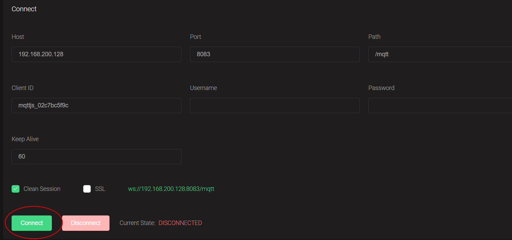
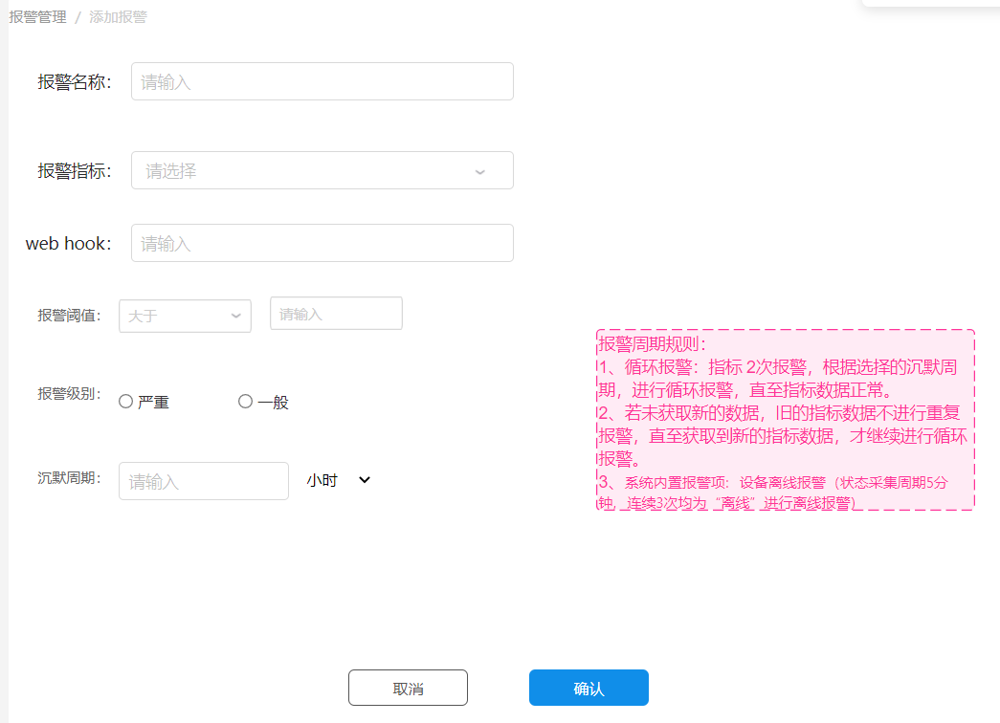
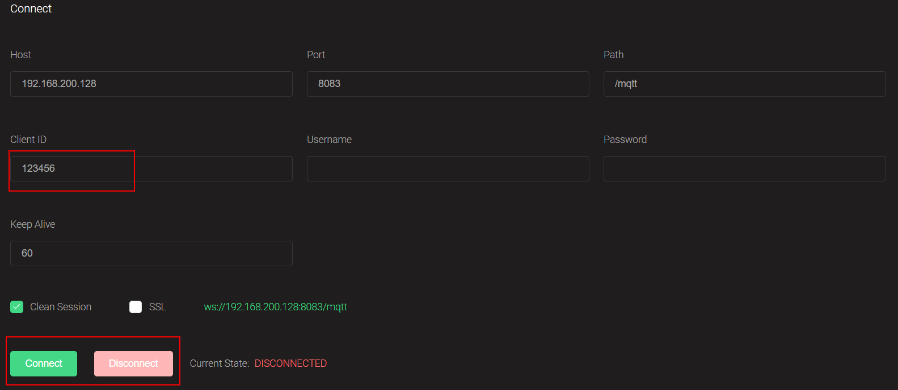

# 第2章 指标数据采集与断连监控

## 学习目标

- 能够完成EMQ指标主题订阅
- 能够完成指标数据的解析
- 能够完成告警判断与存储
- 能够运用EMQ的webhook实现设备断连监控

## 1. EMQ指标主题订阅

更多最新IT精品 www.cx1314.cn

### 1.1 Eclipse paho简介

Eclipse paho是eclipse基金会下面的一个开源项目，基于MQTT协议的客户端，用多种语言的实现。什么是MQTT？可以关注之前的EMQ课程，里面有详细介绍。 这几年的很火的物联网多是基于这个协议来通信的。

Eclipse paho支持的客户端语言很多，有java、Python、JavaScript、GoLang、C 、C++ 、C#等。

这里我们使用的是基于java语言版本的实现，这个版本的实现可以运行在JVM之上或者其他兼容于java的平台，比如安卓平台上。

Paho Java Client提供了两种API：

**MqttAsyncClient**:该API是完全基于异步来实现的，通过在启动时注册一个回调(callbacks)，来实现消息的异步收发处理。

**MqttClient**:是基于同步的方式实现的消息收发处理，在亿可控项目中我们使用同步的方式来接收处理消息。

### 1.2 发送与订阅消息

#### 1.2.1 发送消息

（1）添加和emq通信包paho的引用，paho不光能和emq通信，只要是基于mqtt协议实现的消息代理服务器，paho都能作为客户端和其进行通信。同时编写和mqtt通信的客户端代码。

```xml
<dependency>
    <groupId>org.eclipse.paho</groupId>
    <artifactId>org.eclipse.paho.client.mqttv3</artifactId>
    <version>1.2.2</version>
</dependency>
```

(2) 在consul中添加emq相关的配置：

```yaml
emq:
  mqttServerUrl: tcp://192.168.200.128:1883
```

（3）在com.yikekong.config包下定义emq配置类：

```java
package com.yikekong.config;

import org.springframework.boot.context.properties.ConfigurationProperties;
import org.springframework.context.annotation.Configuration;

@Configuration
@ConfigurationProperties("emq")
@Data
public class EmqConfig{
    private String mqttServerUrl;
}
```

（4）编写EMQ客户端类，新增连接方法

```java
package com.yikekong.emq;

import com.yikekong.config.EmqConfig;
import lombok.extern.slf4j.Slf4j;
import org.eclipse.paho.client.mqttv3.MqttClient;
import org.eclipse.paho.client.mqttv3.MqttConnectOptions;
import org.eclipse.paho.client.mqttv3.MqttException;
import org.eclipse.paho.client.mqttv3.MqttMessage;
import org.eclipse.paho.client.mqttv3.persist.MemoryPersistence;
import org.springframework.beans.factory.annotation.Autowired;
import org.springframework.stereotype.Component;

import java.util.UUID;

@Component
@Slf4j
public class EmqClient{
    @Autowired
    private EmqConfig emqConfig;//emq配置

    private MqttClient mqttClient;

    /**
     * 连接mqtt broker
     */
    public void connect(){
        try {
            mqttClient = new MqttClient(
                 emqConfig.getMqttServerUrl(),"monitor."+ UUID.randomUUID().toString());
                  mqttClient.connect();
        } catch (MqttException e) {
            log.error("mqtt creat error",e);
        }
    }

}
```

（5）编写发布消息的方法

```java
    /**
     * 发布消息
     * @param topic 消息主题
     * @param msg 发送的消息
     */
    public void publish(String topic,String msg){
        try {
            MqttMessage mqttMessage = new MqttMessage(msg.getBytes());
            mqttClient.getTopic(topic).publish(mqttMessage);//向某主题发送消息
        } catch (MqttException e) {
            log.error("mqtt publish msg error",e);
        }
    }
```

测试：

（1）编写单元测试

```java
@SpringBootTest
@RunWith(SpringRunner.class)
public class EmqTest {

    @Autowired
    private EmqClient emqClient;

    @Test
    public void testSend(){
        emqClient.connect();
        emqClient.publish("test_topic","test_content");
    }
}
```

（2）打开EMQ

http://192.168.200.128:18083   ，选择Tools下的Websocket进行测试


（3）连接并订阅主题


输入主题名称test_topic


（4）调用单元测试方法


测试后可以看到列表中有接收到的消息。


#### 1.2.2 订阅消息

（1）EmqClient类新增方法，用于订阅主题

```java
/**
     * 订阅主题
     * @param topicName
     * @throws MqttException
     */
public void subscribe(String topicName) throws MqttException {
      mqttClient.subscribe(topicName);
}
```

（2）接收消息回调类：  com.yikekong.emq包下创建消息接收处理类：

```java
package com.yikekong.emq;
import com.fasterxml.jackson.databind.ObjectMapper;
import com.yikekong.dto.*;
import com.yikekong.entity.GPSEntity;
import com.yikekong.es.ESRepository;
import com.yikekong.service.*;
import lombok.extern.slf4j.Slf4j;
import org.eclipse.paho.client.mqttv3.IMqttDeliveryToken;
import org.eclipse.paho.client.mqttv3.MqttCallback;
import org.eclipse.paho.client.mqttv3.MqttException;
import org.eclipse.paho.client.mqttv3.MqttMessage;
import org.springframework.beans.factory.annotation.Autowired;
import org.springframework.stereotype.Component;
import java.util.Map;

@Component
@Slf4j
public class EmqMsgProcess implements MqttCallback{

    @Override
    public void connectionLost(Throwable throwable) {
    }

    @Override
    public void messageArrived(String topic, MqttMessage mqttMessage) throws Exception {
        String payload = new String(mqttMessage.getPayload());
        System.out.println("接收到数据："+payload);
    }

    @Override
    public void deliveryComplete(IMqttDeliveryToken iMqttDeliveryToken) {

    }

}
```

（3）修改EmqClient的connect方法，添加代码

```java
mqttClient.setCallback(emqMsgProcess);
```

（4）编写监控类，启动后自动订阅主题

```java
package com.yikekong.core;

import com.yikekong.emq.EmqClient;
import com.yikekong.service.QuotaService;
import lombok.extern.slf4j.Slf4j;
import org.eclipse.paho.client.mqttv3.MqttException;
import org.springframework.beans.factory.annotation.Autowired;
import org.springframework.stereotype.Component;
import javax.annotation.PostConstruct;
/**
 * 自动监控
 */
@Component
@Slf4j
public class Monitor{

    @Autowired
    private EmqClient emqClient;

    @PostConstruct
    public void init(){
        emqClient.connect();
        emqClient.subscribe("mytopic");
    }
}
```

测试：

（1）启动工程

（2）打开emq的websocket 工具， 连接，向mytopic主题发送消息




点击发送后，控制台可以显示出接收的消息


### 1.3 订阅指标主题

#### 1.3.1 需求分析

亿可控实现功能：订阅指标配置中的主题。


#### 1.3.2 实现思路

（1）系统启动时，获取所有的主题名称，循环调用订阅主题的方法。

（2）创建新的指标时，根据设置的主题名称订阅。

#### 1.3.3 代码实现

（1）修改Monitor的init方法，实现启动时订阅所有指标配置的主题

```java
@Component
@Slf4j
public class Monitor {

    @Autowired
    private EmqClient emqClient;

    @Autowired
    private QuotaService quotaService;

    @PostConstruct
    public void init(){
        System.out.println("初始化方法，订阅主题");
        emqClient.connect();
        quotaService.getAllSubject().forEach(s -> {
            try {
                emqClient.subscribe("$queue/"+s);
            } catch (MqttException e) {
                e.printStackTrace();
            }
        });
    }
}
```

需要注意的是在订阅主题的时候我们使用了共享队列来接收($queue/)，主要考虑到的是客户端物联网设备的个数比较庞大，在同一时刻或一段时间之内，上报的消息量过于庞大，接收消息的地方会很容易被击垮。使用共享队列，天然的平滑支持了分布式部署，面对巨大的消息量我们只需要部署多份亿可控节点来接收消息并处理就行了，无需做任何复杂的负载均衡处理，这样对研发和部署成本是最低的。

（2）修改QuotaController的create方法，新增主题订阅代码

```java
    @Autowired
    private EmqClient emqClient;

    /**
     * 创建指标
     * @param vo
     * @return
     */
    @PostMapping
    public boolean create(@RequestBody QuotaVO vo){
        try {
            QuotaEntity quotaEntity = new QuotaEntity();
            BeanUtils.copyProperties(vo,quotaEntity);
            emqClient.subscribe("$queue/"+quotaEntity.getSubject());//添加这句！

            return quotaService.save(quotaEntity);
        }catch (DuplicateKeyException e){
            throw new BussinessException("已存在该名称");
        } catch (MqttException e) {
            log.error("订阅主题失败",e);
            return false;
        }
    }
```

（3）丢失连接后再次连接和订阅，修改EmqMsgProcess的connectionLost方法

```java
@Autowired
private QuotaService quotaService;

@Autowired
private EmqClient emqClient;

@Override
public void connectionLost(Throwable throwable) {
    log.info("emq connect lost");
      //当连接丢失时再次连接emq
      emqClient.connect();
    //重新订阅所有主题
      quotaService.getAllSubject().forEach(s -> {
            try {
                subscribe("$queue/"+s);
            } catch (MqttException e) {
                e.printStackTrace();
            }
        });  
}
```

## 2.指标数据解析

### 2.1 需求分析

我们的系统通过后台接口在前端页面中添加的一些指标数据的配置定义，然后在接收到EMQ的数据之后，跟这些提前配置好的数据进行解析。

其中针对指标定义添加的产品页面如下：


- 指标名称：对应将来在系统中需要展示的名称
- 单位：主要是用来解析和保存设备报文中对应的指标数据的单位，比如：摄氏度、米这样的单位
- 报文主题：对应mqtt协议中的报文主题，对应的主题数据就需要在系统中接收和解析处理
- 指标值字段：报文中需要接收解析、处理的字段名称，根据该名称获取对应的值
- 指标值数据类型：就是数据属于什么类型，类似编程语言的数据类型，有Double、String、Boolean等
- 设备识别码字段：对应报文数据中设备编码的字段，主要用来区分设备，方便数据的存取
- web hook：指标数据需要透传到的外部web接口地址
- 安全值：主要用来显示指标数据安全值的一个范围

通过在系统中创建这样的指标数据，方便订阅EMQ主题来接收响应数据并进行后期处理。

### 2.2 实现思路

（1）定义用于封装设备和指标数据的DTO  。

报文有可能是一个设备多个指标

```json
{
 "sn":"123456",
 "temp":1.2,
 "humi":50
}
```

（2）编写业务逻辑方法，接收参数为主题和报文map，根据主题提取字段名称，从报文map中提取数据。

（3）在接收报文后，调用此业务逻辑实现指标数据的解析。

### 2.3 代码实现

（1）创建用于存储指标数据的DTO，封装指标数据

```java
package com.yikekong.dto;

import lombok.Data;

import java.io.Serializable;

/**
 * 指标DTO
 */
@Data
public class QuotaDTO implements Serializable{

    /**
     * 指标ID
     */
    private Integer id;

    /**
     * 指标名称
     */
    private String quotaName;

    /**
     * 单位
     */
    private String unit;

    /**
     * 报文主题
     */
    private String subject;

    /**
     * 指标值字段名称
     */
    private String valueKey;

    /**
     * 指标值数据类型
     */
    private String valueType;

    /**
     * 指标值（数值）
     */
    private Double value;

    /**
     * 指标值(非数值)
     */
    private String  stringValue;

    /**
     * 设备识别码字段(设备Id)
     */
    private String snKey;

    /**
     * web钩子地址
     */
    private String webhook;

    /**
     * 参考值
     */
    private String referenceValue;

    /**
     * 设备Id
     */
    private String deviceId;
}
```

（2）创建用于存储设备和指标列表的DTO

```java
package com.yikekong.dto;
import lombok.Data;
import java.util.List;

@Data
public class DeviceInfoDTO {

    private DeviceDTO device;//设备

    private List<QuotaDTO> quotaList; //指标列表    

}
```

（3）在QuotaService接口里新增方法

```java
/**
 * 解析报文
 * @param topic 主题名称
 * @param payloadMap 报文内容
 * @return 设备（含指标列表）
 */
DeviceInfoDTO analysis(String topic, Map<String, Object> payloadMap);
```

在QuotaServiceImpl实现类里实现该接口方法：

```java
@Override
public DeviceInfoDTO analysis(String topic, Map<String, Object> payloadMap) {

    //1.获取指标配置
    List<QuotaEntity> quotaList = baseMapper.selectBySubject(topic);//根据主题查询指标列表
    if(quotaList.size()==0) return null;

    //2.封装设备信息
    String snKey=quotaList.get(0).getSnKey();
    if( Strings.isNullOrEmpty(snKey)  )  return null;

    String  deviceId = (String) payloadMap.get(snKey);//设备编号
    if( Strings.isNullOrEmpty(deviceId)  )  return null;

    DeviceDTO deviceDTO=new DeviceDTO();
    deviceDTO.setDeviceId(deviceId);

    //3.封装指标列表  :  循环我们根据主题名称查询得指标列表，到报文中提取，如果能够提到，进行封装
    List<QuotaDTO> quotaDTOList=Lists.newArrayList();
    for( QuotaEntity quota:quotaList ){
        String quotaKey = quota.getValueKey();//指标key
        if( payloadMap.containsKey(quotaKey) ){
            QuotaDTO quotaDTO=new QuotaDTO();
            //复制指标配置信息
            BeanUtils.copyProperties( quota, quotaDTO);
            quotaDTO.setQuotaName( quota.getName() );
            //指标值封装
            //指标分为两种  1.数值  2.非数值（string boolean）
            //1.数值   value 存储数值  stringValue :存储数值字符串
            //2.非数值  value 0   stringValue:内容
            //如果是非数值
            if( "String".equals(quotaDTO.getValueType()) || "Boolean".equals(quotaDTO.getValueType()) ){
                quotaDTO.setStringValue(  (String) payloadMap.get(quotaKey) );
                quotaDTO.setValue(0d);
            }else{//如果是数值
                if(  payloadMap.get(quotaKey)  instanceof String ){
                    quotaDTO.setValue( Double.valueOf(   (String) payloadMap.get(quotaKey)  ) );
                    quotaDTO.setStringValue( (String) payloadMap.get(quotaKey)  );
                }else{
                    quotaDTO.setValue( Double.valueOf( payloadMap.get(quotaKey) +"" )  );
                    quotaDTO.setStringValue( quotaDTO.getValue()+"" );
                }
                quotaDTO.setDeviceId( deviceId );
            }
            quotaDTOList.add(quotaDTO);
        }
    }

    //4.封装设备+指标列表返回
    DeviceInfoDTO deviceInfoDTO=new DeviceInfoDTO();
    deviceInfoDTO.setDevice(deviceDTO);
    deviceInfoDTO.setQuotaList(quotaDTOList );

    return deviceInfoDTO;
}
```

编写单元测试类进行测试

```java
import com.fasterxml.jackson.core.JsonProcessingException;
import com.yikekong.YkkApplication;
import com.yikekong.dto.DeviceInfoDTO;
import com.yikekong.service.QuotaService;
import com.yikekong.util.JsonUtil;
import org.junit.Test;
import org.junit.runner.RunWith;
import org.springframework.beans.factory.annotation.Autowired;
import org.springframework.boot.test.context.SpringBootTest;
import org.springframework.test.context.junit4.SpringRunner;

import java.util.HashMap;
import java.util.Map;

@SpringBootTest(classes = YkkApplication.class)
@RunWith(SpringRunner.class)
public class TestQuota {

    @Autowired
    private QuotaService quotaService;

    @Test
    public void testAnalysis(){

        Map map=new HashMap<>();
        map.put("sn","123456"); 
        map.put("temp",1.2);// 也测试一下 map.put("temp","1.2");
        DeviceInfoDTO deviceInfoDTO = quotaService.analysis("temperature", map);
        String json = null;
        try {
            json = JsonUtil.serialize(deviceInfoDTO);
        } catch (JsonProcessingException e) {
            e.printStackTrace();
        }
        System.out.println(json);
    }
}
```

## 3. 告警判断与存储

### 3.1 需求分析

我们需要配置相关指标的报警数据，当设备上报的数据达到报警阈值之后，更新设备的告警状态。



### 3.2 实现思路

（1）在告警服务类中编写方法，封装告警判断逻辑，返回的设备信息中包含告警信息

（2）将包含有告警信息的设备信息保存至elasticsearch中。

### 3.3 代码实现

#### 3.3.1 告警判断逻辑

（1）AlarmService新增方法定义，根据指标信息返回告警信息

```java
/**
 * 根据指标判断告警信息
 * @param quotaDTO
 */
AlarmEntity verifyQuota(QuotaDTO quotaDTO);
```

AlarmServiceImpl实现此方法

```java
@Override
public AlarmEntity verifyQuota(QuotaDTO quotaDTO) {

    //1.根据指标id查询告警判断规则列表
    List<AlarmEntity> alarmEntityList = getByQuotaId(quotaDTO.getId());
    AlarmEntity alarm=null;
    for( AlarmEntity alarmEntity:alarmEntityList ){
        //判断：操作符和指标对比
        if( "String".equals( quotaDTO.getValueType() ) || "Boolean".equals(quotaDTO.getValueType())  ){
            if(  alarmEntity.getOperator().equals("=")  &&  quotaDTO.getStringValue().equals(alarmEntity.getThreshold()) ){
                alarm=alarmEntity;
                break;
            }
        }else //数值
        {
            if(  alarmEntity.getOperator().equals(">")  &&  quotaDTO.getValue()>alarmEntity.getThreshold() ){
                alarm=alarmEntity;
                break;
            }
            if(  alarmEntity.getOperator().equals("<")  &&  quotaDTO.getValue()<alarmEntity.getThreshold() ){
                alarm=alarmEntity;
                break;
            }
            if(  alarmEntity.getOperator().equals("=")  &&  quotaDTO.getValue().equals(alarmEntity.getThreshold()) ){
                alarm=alarmEntity;
                break;
            }
        }
    }
    return alarm;
}
```

（2）QuotaDTO新增用于封装告警信息的属性

```java
private String alarm;//是否告警

private String alarmName;// 告警名称

private String level;//告警级别

private String alarmWebhook;//告警web钩子

private Integer cycle;//沉默周期
```

（3）AlarmService新增方法定义，根据设备信息返回告警信息

```java
/**
 * 根据设备信息判断
 * @param deviceInfoDTO
 */
DeviceInfoDTO verifyDeviceInfo(DeviceInfoDTO deviceInfoDTO);
```

AlarmServiceImpl实现此方法

```java
@Override
public DeviceInfoDTO verifyDeviceInfo(DeviceInfoDTO deviceInfoDTO) {

    // 封装指标的告警  封装设备的告警
    DeviceDTO deviceDTO = deviceInfoDTO.getDevice();

    deviceDTO.setLevel(0);//假设不告警
    deviceDTO.setAlarm(false);
    deviceDTO.setAlarmName("正常");
    deviceDTO.setStatus(true);
    deviceDTO.setOnline(true);

    for(QuotaDTO quotaDTO :deviceInfoDTO.getQuotaList() ){

        AlarmEntity alarmEntity = verifyQuota(quotaDTO);//根据指标得到告警信息
        if(alarmEntity!=null){  //如果指标存在告警

            quotaDTO.setAlarm("1");
            quotaDTO.setAlarmName( alarmEntity.getName() );//告警名称
            quotaDTO.setLevel( alarmEntity.getLevel()+"" );//告警级别
            quotaDTO.setAlarmWebHook(alarmEntity.getWebHook());//告警web钩子
            quotaDTO.setCycle( alarmEntity.getCycle() );//沉默周期
           //存储设备告警信息
            if(alarmEntity.getLevel().intValue()> deviceDTO.getLevel().intValue() ){
                deviceDTO.setLevel( alarmEntity.getLevel() );
                deviceDTO.setAlarm(true);
                deviceDTO.setAlarmName(alarmEntity.getName());
            }

        }else{//如果指标不存储在告警
            quotaDTO.setAlarm("0");
            quotaDTO.setAlarmName("正常");
            quotaDTO.setLevel("0");
            quotaDTO.setAlarmWebHook("");
            quotaDTO.setCycle(0);
        }
    }
    return deviceInfoDTO;
}
```

单元测试：

（1）添加告警数据用于测试

（2）编写单元测试代码，修改TestQuota

```java
import com.fasterxml.jackson.core.JsonProcessingException;
import com.yikekong.YkkApplication;
import com.yikekong.dto.DeviceInfoDTO;
import com.yikekong.service.AlarmService;
import com.yikekong.service.QuotaService;
import com.yikekong.util.JsonUtil;
import org.junit.Test;
import org.junit.runner.RunWith;
import org.springframework.beans.factory.annotation.Autowired;
import org.springframework.boot.test.context.SpringBootTest;
import org.springframework.test.context.junit4.SpringRunner;
import java.util.HashMap;
import java.util.Map;

@SpringBootTest(classes = YkkApplication.class)
@RunWith(SpringRunner.class)
public class TestQuota {

    @Autowired
    private QuotaService quotaService;

    @Autowired
    private AlarmService alarmService;

    /**
     * 测试报文解析(告警)
     */
    @Test
    public void testAnalysis(){

        Map map=new HashMap<>();
        map.put("sn","123456");
        map.put("temp",12);
        DeviceInfoDTO deviceInfoDTO = quotaService.analysis("temperature", map);
        //告警信息封装
        DeviceInfoDTO deviceInfoDTO1 = alarmService.verifyDeviceInfo(deviceInfoDTO);
        String json = null;
        try {
            json = JsonUtil.serialize(deviceInfoDTO1);
        } catch (JsonProcessingException e) {
            e.printStackTrace();
        }
        System.out.println(json);
    }
}
```

#### 3.3.2 设备告警信息保存

（1）DeviceService新增方法定义

```java
/**
 * 存储设备信息
 * @param deviceDTO
 * @return
 */
boolean saveDeviceInfo(DeviceDTO deviceDTO);
```

  DeviceServiceImpl实现此方法

```java
@Override
public boolean saveDeviceInfo(DeviceDTO deviceDTO) {
    //查询设备 ，判断开关状态 ，如果是关闭则不处理
    DeviceDTO device= findDevice(deviceDTO.getDeviceId());
    if( device!=null && !device.getStatus() ) return false;

    // 如果当前设备查不到，新增
    if(device==null){
        esRepository.addDevices( deviceDTO );
    }else{
        //如果可以查询到，更新告警信息
        esRepository.updateDevicesAlarm(deviceDTO);
    }
    return true;
}
```

（2）修改EmqMsgProcess的messageArrived方法，实现告警判断和保存设备信息

```java
@Autowired
private AlarmService alarmService;

@Autowired
private DeviceService deviceService;

@Override
public void messageArrived(String topic, MqttMessage mqttMessage) throws Exception {
    String payload = new String(mqttMessage.getPayload());
    ObjectMapper mapper = new ObjectMapper();
    Map<String, Object> payloadMap = mapper.readValue(payload, Map.class);
    System.out.println("接收到数据："+payloadMap);
    //解析数据
    DeviceInfoDTO deviceInfoDTO = quotaService.analysis(topic, payloadMap);
    if(deviceInfoDTO!=null){
        //告警判断
        deviceInfoDTO= alarmService.verifyDeviceInfo(deviceInfoDTO);  //返回包含了告警判断的对象
        //保存设备信息
        deviceService.saveDeviceInfo(deviceInfoDTO.getDevice());
    }
}
```

测试：

（1）启动亿可控

（2）用kibana查看当前设备的告警信息

（3）通过emq模拟发送报文

## 4. 设备断连监控

### 4.1 需求分析

在系统中要对设备的断网情况进行监控，发现设备断网后更新设备状态。我们可以使用EMQ的webHook来实现。

### 4.2 EMQ WebHook介绍

WebHook是由`emqx_web_hook`插件提供的将EMQ X中的钩子时间通知到某个Web服务的功能。WebHook的内部实现是基于EMQ X内部的钩子，它通过钩子上挂载的回调函数获取到EMQ X中的各种事件，并转发到`emqx_web_hook`中配置的Web服务器接口中。


WebHook 对于事件的处理是单向的，**它仅支持将 EMQ X 中的事件推送给 Web 服务，并不关心 Web 服务的返回**。 借助 Webhook 可以完成设备在线、上下线记录，订阅与消息存储、消息送达确认等诸多业务。

 Webhook 的配置文件位于 `etc/plugins/emqx_web_hook.conf`： 

| 配置项            | 类型     | 可取值              | 默认值                   | 说明                                      |
| -------------- | ------ | ---------------- | --------------------- | --------------------------------------- |
| api.url        | string | -                | http://127.0.0.1:8080 | 事件需要转发的目的服务器地址                          |
| encode_payload | enum   | `base64`, base62 | undefined             | 对**消息类事件中的 Payload 字段**进行编码，注释或其他则表示不编码 |

说明：当消息内容是不可见字符（如二进制数据）时，为了能够在 HTTP 协议中传输，使用 encode_payload 是十分有用的。

**配置触发规则：**

 在 `etc/plugins/emqx_web_hooks.conf` 可配置触发规则，其配置的格式如下： 

```
## 格式示例
web.hook.rule.<Event>.<Number> = <Rule>

## 示例值
web.hook.rule.message.publish.1 = {"action": "on_message_publish", "topic": "a/b/c"}
web.hook.rule.message.publish.2 = {"action": "on_message_publish", "topic": "foo/#"}
```

**Event 触发事件:**

目前支持以下事件： 

| 名称                   | 说明     | 执行时机                              |
| -------------------- | ------ | --------------------------------- |
| client.connect       | 处理连接报文 | 服务端收到客户端的连接报文时                    |
| client.connack       | 下发连接应答 | 服务端准备下发连接应答报文时                    |
| client.connected     | 成功接入   | 客户端认证完成并成功接入系统后                   |
| client.disconnected  | 连接断开   | 客户端连接层在准备关闭时                      |
| client.subscribe     | 订阅主题   | 收到订阅报文后，执行 `client.check_acl` 鉴权前 |
| client.unsubscribe   | 取消订阅   | 收到取消订阅报文后                         |
| session.subscribed   | 会话订阅主题 | 完成订阅操作后                           |
| session.unsubscribed | 会话取消订阅 | 完成取消订阅操作后                         |
| message.publish      | 消息发布   | 服务端在发布（路由）消息前                     |
| message.delivered    | 消息投递   | 消息准备投递到客户端前                       |
| message.acked        | 消息回执   | 服务端在收到客户端发回的消息 ACK 后              |
| message.dropped      | 消息丢弃   | 发布出的消息被丢弃后                        |

**Number**

同一个事件可以配置多个触发规则，配置相同的事件应当依次递增。

**Rule**

触发规则，其值为一个 JSON 字符串，其中可用的 Key 有：

- action：字符串，取固定值
- topic：字符串，表示一个主题过滤器，操作的主题只有与该主题匹配才能触发事件的转发

例如，我们只将与 `a/b/c` 和 `foo/#` 主题匹配的消息转发到 Web 服务器上，其配置应该为：

```bash
web.hook.rule.message.publish.1 = {"action": "on_message_publish", "topic": "a/b/c"}
web.hook.rule.message.publish.2 = {"action": "on_message_publish", "topic": "foo/#"}
```

这样 Webhook 仅会转发与 `a/b/c` 和 `foo/#` 主题匹配的消息，例如 `foo/bar` 等，而不是转发 `a/b/d` 或 `fo/bar`。

**开启WebHook**

在EMQ中，点击菜单Plugins ，找到  EMQ X WebHook Plugin，点击后边的start开启


### 4.3 实现思路

（1）在EMQ中配置webhook针对客户端断连情况的节点，指向亿可控系统的接收地址

（2）开发亿可控接收断连接口来接收EMQ传入的数据

### 4.4 代码实现

#### 4.4.1 断连监控实现

（1）在亿可控项目编写接收EMQ传入的数据。在DeviceController中添加如下方法：

```java
/**
 * 接收设备断连信息
 * @param param
 */
@PostMapping("/clientAction")
public void clientAction(@RequestBody  Map<String,String> param){
    System.out.println(param);
}
```

（2）修改AuthFilter的doFilter方法，添加放行地址：

```java
//如果是设备断链监控
if(path.equals("/device/clientAction")){
      filterChain.doFilter(servletRequest, servletResponse);
     return;
}
```

（3）编辑EMQ的配置文件`etc/plugins/emqx_web_hook.conf`将亿可控的接收地址配置到`web.hook.api.url`，然后只打开客户端连接和断开的触发规则，具体配置如下：

```
##====================================================================
## WebHook
##====================================================================

## The web services URL for Hook request
##
## Value: String
##亿可控接收地址
web.hook.api.url = http://192.168.3.4:9093/device/clientAction

## Encode message payload field
##
## Value: base64 | base62
## web.hook.encode_payload = base64

##--------------------------------------------------------------------
## Hook Rules

## These configuration items represent a list of events should be forwarded
##
## Format:
##   web.hook.rule.<HookName>.<No> = <Spec>
web.hook.rule.client.connected.1     = {"action": "on_client_connected"}
web.hook.rule.client.disconnected.1  = {"action": "on_client_disconnected"}
```

注意：192.168.3.4是我windows宿主机的ip ,同学们需要在windows宿主机执行ipconfig获得此ip

（4）重新启动emq容器

测试：使用EMQ的Websocket工具，点击连接和断开连接，观测控制台的日志输出

```
{username=, proto_ver=4, keepalive=60, ipaddress=192.168.200.1, connected_at=1599791080405, clientid=mqttjs_11aebe9694, action=client_connected}
{username=, reason=normal, clientid=mqttjs_11aebe9694, action=client_disconnected}
```

上面的结果中，clientid就是设备的id，action是发生的事件：client_connected表示连接  client_disconnected表示断开连接

#### 4.4.2 更新设备在线状态

（1）DeviceService新增方法定义

```java
/**
 * 更新在线状态
 * @param deviceId
 * @param online
 */
void updateOnline(String deviceId, Boolean online);
```

DeviceServiceImpl类实现此方法

```java
/**
 * 更新
 * @param deviceId
 * @param online
 */
@Override
public void updateOnline(String deviceId, Boolean online){
    //以webclient开头的client为系统前端,monitor开头的是亿可控服务端
    if(deviceId.startsWith("webclient") || deviceId.startsWith("monitor")){
        return;
    }
    //更新数据到es
    DeviceDTO deviceDTO = findDevice(deviceId);
    if(deviceDTO == null) return;

    deviceDTO.setOnline(online);
    esRepository.updateOnline(deviceId,online);
}
```

（2）修改DeviceController的clientAction方法

```java
/**
 * 接收设备断连信息
 * @param param
 */
@PostMapping("/clientAction")
public void clientAction(@RequestBody  Map<String,String> param){
    System.out.println(param);
    String deviceId = param.get("clientid");  //提取设备id
    if( param.get("action").equals("client_connected") ){ //如果是联网
        deviceService.updateOnLine(deviceId,true);
    }
    if( param.get("action").equals("client_disconnected") ){ //如果是断网
        deviceService.updateOnLine(deviceId,false);
    }
}
```

测试：

（1）启动亿可控项目

（2）使用kibana查询现有的设备数据

（3）使用EMQ 的Websocket工具模拟设备的连接与断开，clientID就是设备id

