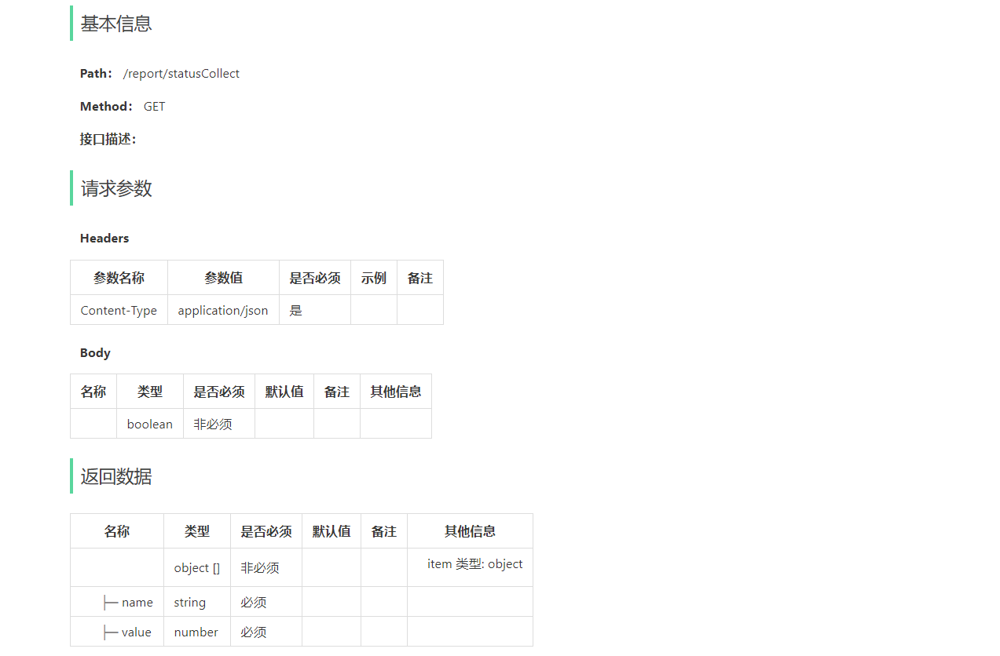
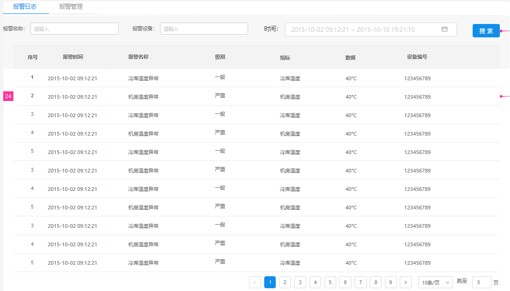
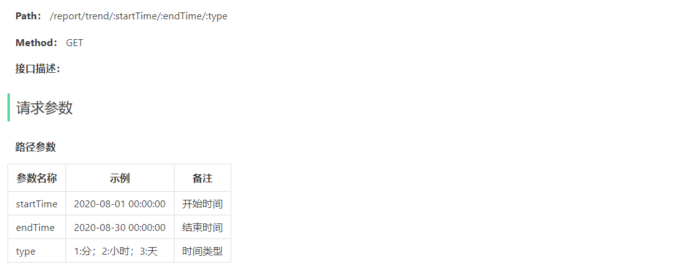
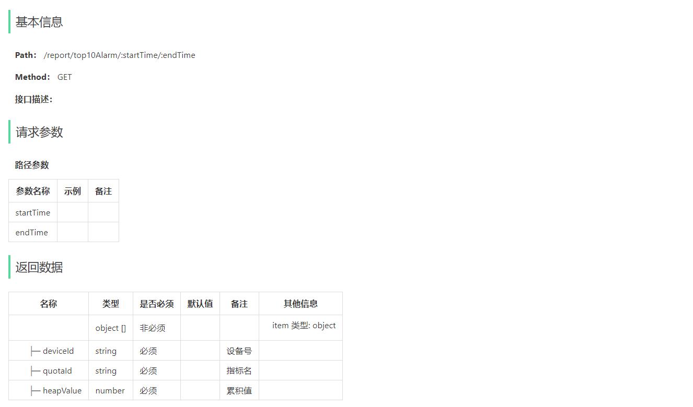
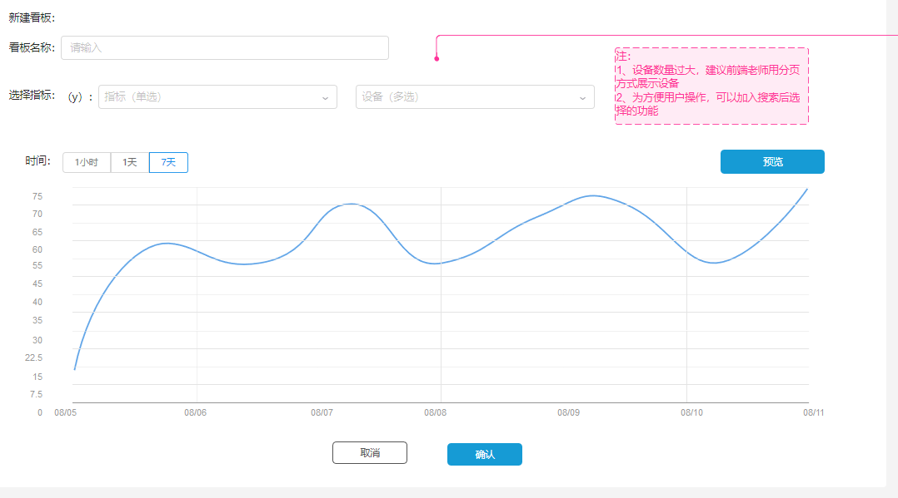
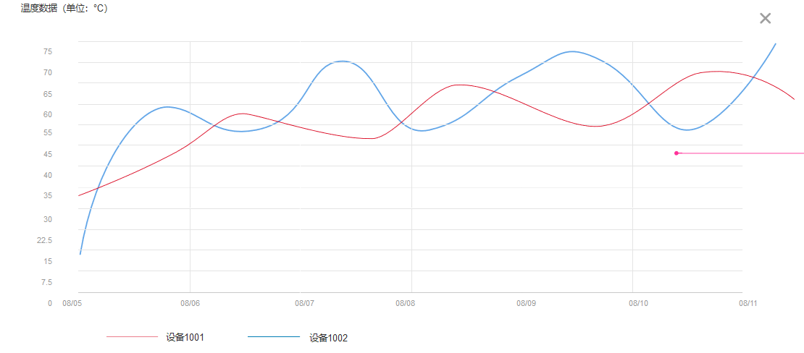
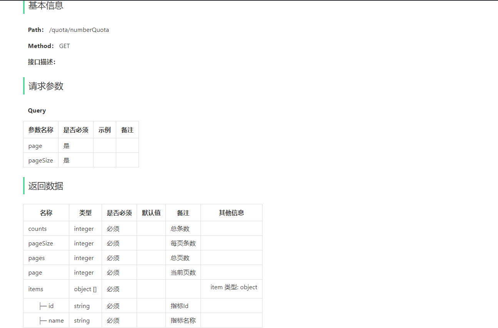
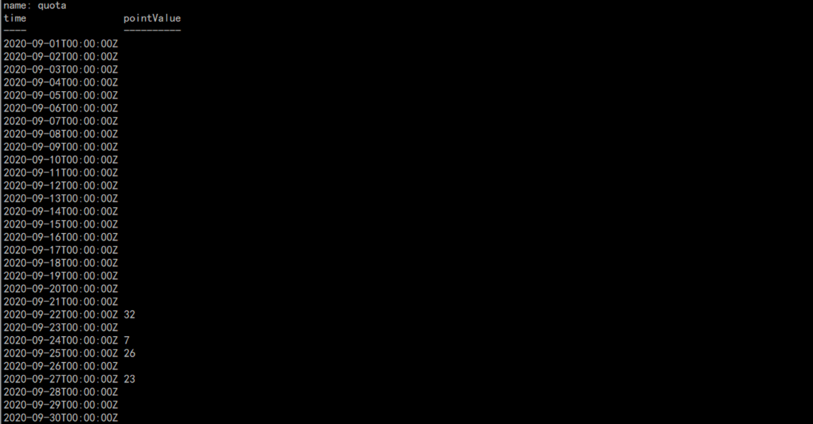
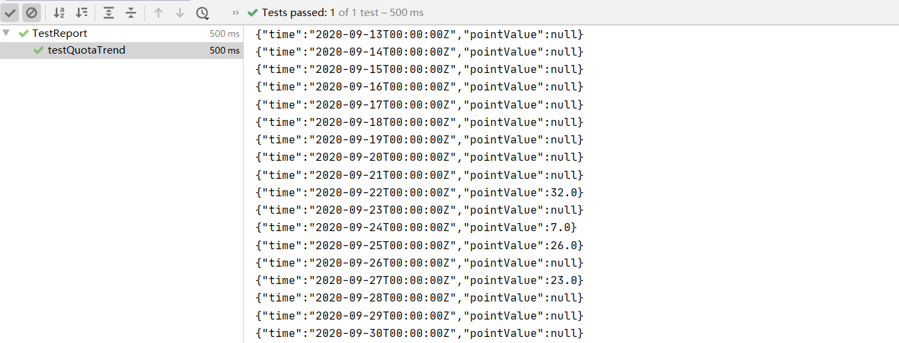

# 第四章 报表分析

产品原型地址：

https://app.mockplus.cn/run/prototype/wDiGCuki3_/iLu4KtCQ8ew/1Bv0BoAUyv

## 1. 设备状态统计

更多最新IT精品 www.cx1314.cn

### 1.1 需求分析 

系统内要在首页以饼图的方式显示不同状态设备的占比百分比分布，具体效果如下图：


### 1.2 实现思路 

（1）编写从ElasticSearch中获取断网设备总数、断网数量、告警数量的方法

（2）通过运算的到正常设备数，将数据组合成前端需要的数据格式返回

### 1.3 代码实现 

#### 1.3.1 设备数量统计

（1）在ESRepository添加统计全部设备数量的方法：

```java
/**
 * 统计所有设备数量
 * @return
 */
public Long getAllDeviceCount(){

    CountRequest countRequest=new CountRequest("devices");
    countRequest.query( QueryBuilders.matchAllQuery() );
    try {
        CountResponse response = restHighLevelClient.count(countRequest, RequestOptions.DEFAULT);
        return response.getCount();
    } catch (IOException e) {
        e.printStackTrace();
        return 0L;
    }
}
```

（2）在ESRepository添加统计离线设备数量的方法：

```java
/**
 * 统计所有离线设备数量
 * @return
 */
public Long getOfflineCount(){

    CountRequest countRequest=new CountRequest("devices");
    BoolQueryBuilder boolQueryBuilder=QueryBuilders.boolQuery();
    boolQueryBuilder.must( QueryBuilders.termQuery("online",false)  );

    countRequest.query( boolQueryBuilder );

    try {
        CountResponse response = restHighLevelClient.count(countRequest, RequestOptions.DEFAULT);
        return response.getCount();
    } catch (IOException e) {
        e.printStackTrace();
        return 0L;
    }

}
```

（3）在ESRepository添加统计报警设备数量的方法：

```java
/**
 * 统计所有告警设备数量
 * @return
 */
public Long getAlarmCount(){

    CountRequest countRequest=new CountRequest("devices");
    BoolQueryBuilder boolQueryBuilder=QueryBuilders.boolQuery();
    boolQueryBuilder.must( QueryBuilders.termQuery("online",true)  );
    boolQueryBuilder.must( QueryBuilders.termQuery("alarm",true)  );
    countRequest.query( boolQueryBuilder );

    try {
        CountResponse response = restHighLevelClient.count(countRequest, RequestOptions.DEFAULT);
        return response.getCount();
    } catch (IOException e) {
        e.printStackTrace();
        return 0L;
    }

}
```

编写单元测试：

```java
@Test
public void testCount(){

    Long allDeviceCount = esRepository.getAllDeviceCount();//设备总数
    System.out.println("设备总数："+allDeviceCount);

    Long offlineCount = esRepository.getOfflineCount();//离线设备数量
    System.out.println("离线设备："+offlineCount);

    Long alarmCount = esRepository.getAlarmCount();//告警设备数量
    System.out.println("告警设备："+alarmCount);

}
```

#### 1.3.2 设备状态分布

（1）添加vo，用于状态占比的封装

前端采用的图表工具是EChars，EChars饼图需要数据格式如下：

```json
data: [
           {value: 10200, name: '正常运转'},
           {value: 310, name: '离线'},
           {value: 234, name: '报警'}          
      ]
```

API 定义如下：



我们根据前端需要的格式定义vo

```java
package com.yikekong.vo;

import lombok.Data;

@Data
public class PieVO {

    private String name;//名称

    private Long value;//值
}
```

（2）创建报表服务接口ReportService，并定义获取设备状态分布的方法

```java
package com.yikekong.service;

import com.yikekong.vo.PieVO;

import java.util.List;

/**
 * 报表服务
 */
public interface ReportService {


    /**
     * 设备状态分布
     * @return
     */
    List<PieVO> getStatusCollect();

}
```

创建实现类，并在实现类中实现该方法

```java
package com.yikekong.service.impl;

import com.google.common.collect.Lists;
import com.yikekong.es.ESRepository;
import com.yikekong.service.ReportService;
import com.yikekong.vo.PieVO;
import lombok.extern.slf4j.Slf4j;
import org.springframework.beans.factory.annotation.Autowired;
import org.springframework.stereotype.Service;

import java.util.List;
@Service
@Slf4j
public class ReportServiceImpl implements ReportService {

    @Autowired
    private ESRepository esRepository;

    @Override
    public List<PieVO> getStatusCollect() {

        Long allDeviceCount = esRepository.getAllDeviceCount();//全部设备数量
        Long offlineCount = esRepository.getOfflineCount();//离线设备数量
        Long alarmCount = esRepository.getAlarmCount();//报警设备数量

        PieVO devicePie=new PieVO();
        devicePie.setName("正常运转");
        devicePie.setValue(allDeviceCount-offlineCount-alarmCount);

        PieVO offlinePie=new PieVO();
        offlinePie.setName("离线");
        offlinePie.setValue(offlineCount);

        PieVO alarmPie =new PieVO();
        alarmPie.setName("报警");
        alarmPie.setValue(alarmCount);

        List<PieVO> pieVOList= Lists.newArrayList();
        pieVOList.add(devicePie);
        pieVOList.add(offlinePie);
        pieVOList.add(alarmPie);

        return pieVOList;
    }
}
```

（3）DeviceController新增方法

```java
package com.yikekong.controller;

import com.yikekong.service.ReportService;
import com.yikekong.vo.PieVO;
import org.springframework.beans.factory.annotation.Autowired;
import org.springframework.web.bind.annotation.GetMapping;
import org.springframework.web.bind.annotation.RequestMapping;
import org.springframework.web.bind.annotation.RestController;

import java.util.List;

@RestController
@RequestMapping("/report")
public class ReportController {

    @Autowired
    private ReportService reportService;

    /**
     * 设备状态分布
     * @return
     */
    @GetMapping("/statusCollect")
    public List<PieVO> getStatusCollect(){
        return  reportService.getStatusCollect();
    }

}
```

#### 1.3.3 实时监控数据

首页还需要显示设备数量和报警设备数



API设计：


（1）创建vo类 MonitorVO

```java
/**
 * 实时监控数据
 */
@Data
public class MonitorVO implements Serializable{
    /**
     * 设备数量
     */
    private Long deviceCount;
    /**
     * 告警设备数
     */
    private Long alarmCount;
}
```

（2）ReportController新增方法

```java
@Autowired
private ESRepository esRepository;

/**
 * 获取实时监控数据
 * @return
 */
@GetMapping("/monitor")
public MonitorVO getMonitorData(){
    MonitorVO monitor = new MonitorVO();
    monitor.setDeviceCount(esRepository.getAllDeviceCount());
    monitor.setAlarmCount(esRepository.getAlarmCount());
    return monitor;
}
```


## 2. 异常告警趋势报表

### 2.1 需求分析

系统要能够根据当前1小时内（每分钟第一次数据，当前分钟无数据，显示上一次数据）、当前1天内（每小时第一次数据，当前小时无数据，显示上一次数据）、当前7天内（7天小时数据的展示），汇总出每一个时间点上报的异常总数，然后前端根据这些数据以折现图的形式进行展现。

具体时间筛选和展现的格式如下：


横轴显示时间，纵轴显示的是告警次数汇总值数量。

### 2.2 实现思路 

（1）查询influxdb中的quota表，根据时间点进行分组统计

（2）在服务层实现对语句的封装，转化成前端需要的数据格式

### 2.3 代码实现 

#### 2.3.1 influxdb时间分组统计

日期格式化命令，执行后可以显示年月日小时分秒

```
precision rfc3339
```

执行查询

```sql
select count(value) from quota where alarm='1' and time>='2020-09-01' and time<='2020-09-30' group by time(1d)
```

得到运行结果


这里需要说明的是：

在要执行的sql里的group by分组里使用了InfluxDB的time时间函数

- group by time(1m):按每分钟进行分组汇总
- group by time(1h):按每小时进行分组汇总
- groupby time(1d):按每天进行分组汇总

之后配合select中的count函数就可以获取到具体时间维度里汇总里的总数了，这样就能获取到我们想要的汇总数据了。

InfluxDB除了会根据sql语句返回pointValue也会同时返回每一条数据对应的time时间列。

#### 2.3.2 告警趋势统计

（1）定义从InfluxDB中查询结果的pojo类：

```java
package com.yikekong.dto;

import lombok.Data;
import org.influxdb.annotation.Column;
import org.influxdb.annotation.Measurement;
import java.io.Serializable;

/**
 * 趋势指标点
 */
@Data
@Measurement(name = "quota")
public class TrendPoint implements Serializable{

    /**
     * 时间
     */
    @Column(name = "time")
    private String time;

    /**
     * 时间点数据
     */
    @Column(name = "pointValue")
    private Integer pointValue;
}
```

（3）在ReportService接口中定义获取异常指标趋势的方法：

```java
/**
 * 获取异常趋势指标
 * @param start 开始时间 yyyy-MM-dd HH:mm:ss
 * @param end 结束时间 yyyy-MM-dd HH:mm:ss
 * @param type 时间统计类型(1:60分钟之内,2:当天24小时,3:7天内)
 * @return
 */
List<TrendPoint> getAlarmTrend(String start, String end, int type);
```

在实现类ReportServiceImpl中实现该方法：

```java
@Autowired
private InfluxRepository influxRepository;

@Override
public List<TrendPoint> getAlarmTrend(String start, String end, int type) {

    StringBuilder ql=new StringBuilder("select count(value) as pointValue from quota where alarm='1' ");
    ql.append("and time>='"+ start +"' and time<='"+ end+"' ");
    if(type==1){
        ql.append("group by time(1m)");
    }
    if(type==2){
        ql.append("group by time(1h)");
    }
    if(type==3){
        ql.append("group by time(1d)");
    }
    List<TrendPoint> trendPointList = influxRepository.query(ql.toString(), TrendPoint.class);

    return trendPointList;
}
```

单元测试：

```java
@Autowired
private ReportService reportService;

@Test
public void testAlarmTrend(){

    List<TrendPoint> trendPointList = reportService.getAlarmTrend("2020-09-01", "2020-09-30", 3);

    for(TrendPoint trendPoint:trendPointList){
        try {
            System.out.println(JsonUtil.serialize(trendPoint));
        } catch (JsonProcessingException e) {
            e.printStackTrace();
        }
    }

}
```

分别尝试getAlarmTrend的第2个参数为 1、 2、 3 ，观察测试结果，下面是参数为3的测试结果：

```json
{"time":"2020-09-01T00:00:00Z","pointValue":0}
{"time":"2020-09-02T00:00:00Z","pointValue":0}
{"time":"2020-09-03T00:00:00Z","pointValue":0}
{"time":"2020-09-04T00:00:00Z","pointValue":0}
{"time":"2020-09-05T00:00:00Z","pointValue":0}
{"time":"2020-09-06T00:00:00Z","pointValue":0}
{"time":"2020-09-07T00:00:00Z","pointValue":0}
{"time":"2020-09-08T00:00:00Z","pointValue":0}
{"time":"2020-09-09T00:00:00Z","pointValue":0}
{"time":"2020-09-10T00:00:00Z","pointValue":0}
{"time":"2020-09-11T00:00:00Z","pointValue":0}
{"time":"2020-09-12T00:00:00Z","pointValue":0}
{"time":"2020-09-13T00:00:00Z","pointValue":0}
{"time":"2020-09-14T00:00:00Z","pointValue":0}
{"time":"2020-09-15T00:00:00Z","pointValue":0}
{"time":"2020-09-16T00:00:00Z","pointValue":0}
{"time":"2020-09-17T00:00:00Z","pointValue":0}
{"time":"2020-09-18T00:00:00Z","pointValue":0}
{"time":"2020-09-19T00:00:00Z","pointValue":2}
{"time":"2020-09-20T00:00:00Z","pointValue":0}
{"time":"2020-09-21T00:00:00Z","pointValue":0}
{"time":"2020-09-22T00:00:00Z","pointValue":2379}
{"time":"2020-09-23T00:00:00Z","pointValue":0}
{"time":"2020-09-24T00:00:00Z","pointValue":14412}
{"time":"2020-09-25T00:00:00Z","pointValue":5}
{"time":"2020-09-26T00:00:00Z","pointValue":0}
{"time":"2020-09-27T00:00:00Z","pointValue":0}
{"time":"2020-09-28T00:00:00Z","pointValue":0}
{"time":"2020-09-29T00:00:00Z","pointValue":0}
{"time":"2020-09-30T00:00:00Z","pointValue":0}
```

#### 2.3.3 报表数据封装

前端采用的图表工具是EChars，折线图所需的数据格式为：

```json
xAxis: {
  type: 'category',
  data: ['Mon', 'Tue', 'Wed', 'Thu', 'Fri', 'Sat', 'Sun']
},
yAxis: {
  type: 'value'
},
series: [{
  data: [820, 932, 901, 934, 1290, 1330, 1320],
  type: 'line'
}]
```

以上格式可以在 [https://echarts.apache.org/examples/zh/index.html](https://echarts.apache.org/examples/zh/index.html)  查询

API定义接口定义如下：




（1）定义前端展示需要的VO类，代码如下：

```java
package com.yikekong.vo;

import lombok.Data;

import java.io.Serializable;
import java.util.List;

/**
 * 折线图封装类
 */
@Data
public class LineVO implements Serializable {

    private List<String>  xdata;//x轴

    private List<Long> series;//数据
}
```

（2）在ReportController中添加方法调用getAlarmTrend获取数据并做转换返回给前端

```java
/**
 * 获取告警趋势
 * @return
 */
@GetMapping("/trend/{startTime}/{endTime}/{type}")
public LineVO getQuotaTrendCollect(@PathVariable String startTime,@PathVariable String endTime,@PathVariable Integer type){
    List<TrendPoint> trendPointList = reportService.getAlarmTrend(startTime, endTime, type);
    LineVO lineVO=new LineVO();
    lineVO.setXdata(Lists.newArrayList());
    lineVO.setSeries(Lists.newArrayList());
    trendPointList.forEach( t->{
        lineVO.getXdata().add( t.getTime() );
        lineVO.getSeries().add( t.getPointValue().longValue());
    });
    return lineVO;
}
```

测试：

http://127.0.0.1:9093/report/trend?start=2020-08-01&end=2020-08-31&type=3

#### 2.3.4 时间格式处理

需求：

经过刚才的测试，我们返回的日期格式是 2020-09-01T00:00:00Z。但是前端需要的格式是

如果是分钟，显示分钟值

如果是小时，显示小时值

如果是日，显示 xx月xx日

（1）ReportController新增私有方法，用于格式化日期串

```java

/**
 * 格式化日期串
 * @param time
 * @param type
 * @return
 */
private String formatTime(String time,int type){
    LocalDateTime localTime = LocalDateTime.parse(time,DateTimeFormatter.ISO_OFFSET_DATE_TIME);
    if(type == 1){
       return  localTime.getMinute()+"";
    }else if(type == 2){
        return localTime.getHour()+"";
    }else if(type == 3){
        return localTime.getMonthValue()+"月"+localTime.getDayOfMonth()+"日";
    }
    return time;
}
```

（2）修改getAlarmTrend方法，调用formatTime实现日期格式化

```java
/**
 * 获取告警趋势
 * @return
 */
@GetMapping("/trend/{startTime}/{endTime}/{type}")
public LineVO getQuotaTrendCollect(@PathVariable String startTime,@PathVariable String endTime,@PathVariable Integer type){

    List<TrendPoint> trendPointList = reportService.getAlarmTrend(startTime, endTime, type);

    LineVO lineVO=new LineVO();
    lineVO.setXdata(Lists.newArrayList());
    lineVO.setSeries(Lists.newArrayList());

    trendPointList.forEach( t->{
        lineVO.getXdata().add( formatTime(t.getTime(),type) );//修改这一句
        lineVO.getSeries().add( t.getPointValue().longValue());
    });

    return lineVO;
}
```

## 3. 告警次数top10设备指标报表 

### 3.1 需求分析 

系统需要展示出当前一小时内、当前1天内、当前7天内的告警次数最多的前10的设备及指标，以柱状图展示，展示效果如下：


其中纵轴展示的是设备编号+指标名称，横轴用来展示告警次数，按照从多到少进行排列。

### 3.2 实现思路 

（1）编写查询语句，实现异常次数top10统计。我们这里会学习一个新的函数top。

（2）定义InfluxDB中检索出的具体pojo类，包括属性有设备id、指标id、指标名称、统计出来的次数

（3）在AlarmService服务接口里定义获取在一定时间范围内的top10告警设备指标，在实现类里进行实现

（4） 在Controller中调用Service中的方法获取数据返回给前端

### 3.3 代码实现 

#### 3.3.1 告警次数top10查询

（1）首先编写查询语句，根据设备ID和指标ID分组查询报警数量

```sql
select count(value) as heapValue 
  from quota 
  where alarm='1'  and time>='2020-09-01' and time<='2020-09-30' 
  group by deviceId,quotaId,quotaName
```

注意：在标准的SQL语法中，分组的条件是必须出现在select字句后边的，而influxQL不用那么写。

上边的语句运行效果如下： 


（2）上边的结果其实是我们要的中间结果，我们还应该在此结果基础上得到前10的数据，需要用到top函数

```sql
select top(heapValue,deviceId,quotaId,quotaName,10) as heapValue 
from  (
  select count(value) as heapValue 
  from quota 
  where alarm='1'  and time>='2020-09-01' and time<='2020-09-30' 
  group by deviceId,quotaId  ) 
order by desc
```

top函数第一个参数是需要排序的字段，最后一个参数是得到的结果数量，中间的参数是需要列出的其它数据。

上边的语句运行结果如下：


#### 3.3.2 报表数据查询与封装

API设计如下：



（1）定义top10对应的pojo类

```java
package com.yikekong.dto;
import lombok.Data;
import org.influxdb.annotation.Column;
import org.influxdb.annotation.Measurement;
import java.io.Serializable;
/**
 * 累积指标
 */
@Data
@Measurement(name = "quota")
public class HeapPoint implements Serializable{
    @Column(name = "deviceId")
    private String deviceId;
    @Column(name = "heapValue")
    private Double heapValue;
    @Column(name = "quotaId")
    private String quotaId;
    @Column(name = "quotaName")
    private String quotaName;
}
```

（2）在ReportService服务接口里定义获取数据的方法

```java
/**
 * 获取一定时间范围之内的报警次数最多的设备指标
 * @return
 */
List<HeapPoint> getTop10Alarm(String startTime, String endTime);
```

在ReportServiceImpl实现类里实现该方法：

```java
@Override
public List<HeapPoint> getTop10Alarm(String startTime, String endTime) {
    StringBuilder sbSql =
            new StringBuilder("select top(heapValue,deviceId,quotaId,quotaName,10) as heapValue " +
                    " from(select count(value) as heapValue from quota where alarm='1' ");
    sbSql.append("and time>='");
    sbSql.append(startTime);
    sbSql.append("' and time<='");
    sbSql.append(endTime);
    sbSql.append("' group by deviceId,quotaId) order by desc");

    return influxDBRepository.query(sbSql.toString(),HeapPoint.class);
}
```

这里sql语句的具体实现思路是：sql子查询里获取的是一定时间范围之内根据设备和指标分组之后的告警总数，然后在外部查询里用top函数对倒序之后的结果集取前十就能获取到我们想要的数据。

（3）在ReportController里添加获取前十数据的方法，在该方法里调用服务层的方法返回给前端：

```java
/**
 * 获取一定时间范围之内的告警次数前10最多的设备指标
 * @param startTime
 * @param endTime
 * @return
 */
@GetMapping("/top10Alarm/{startTime}/{endTime}")
public List<HeapPoint> getTop10Alarm(@PathVariable String startTime, @PathVariable String endTime){
    return reportService
                    .getTop10Alarm(startTime,endTime);
}
```

## 4. 自定义指标看板 

### 4.1 需求分析 

系统管理人员能够在系统里可以添加自定义的看板来展示数据，该自定义看板是用户自己选择的指标，及根据指标自主选取上报该指标的一些设备，以方便跟踪和观察该指标下相关设备的趋势，展示的趋势也是多个维度的，按照小时展示当前1小时内60分钟的指标相关设备趋势；按照1天24小时展示当天每小时的指标设备趋势；按照7天展示最近7天之内24小时的指标设备趋势。

添加看板的原型图如下：



在首页展示已经添加的看板原型设计如下：



横轴展示的是时间，纵轴的数据是每个时间点内的设备首次上报指标数据。

### 4.2 实现思路 

（1）在系统添中加看板时只能选择数值型指标，从mysql数据库中分页加载所有数值型指标，指标是单选

（2）添加看板时选择完指标之后，在选择设备时只能选择之前已经选择好的指标下的上报过该指标的设备，设备是多选，最多选择10个设备

（3）在向前端提供数据时，先从mysql中查询出该面板的指标Id，及对应的所有设备编号，根据前端传入的时间类型从InfluxDB中循环获取相应时间段内，对应时间的所有设备指标的首次指标数值

（4）将所有数据组合成前端想要的数据格式返回

### 4.3 代码实现 

#### 4.3.1 获取数值型指标列表



（1）从mysql数据库中分页加载所有数值型指标，在QuotaService接口中定义方法

```java
IPage<QuotaEntity> queryNumberQuota(Long page, Long pageSize);
```

在QuotaServiceImpl实现类中实现该方法：

```java
@Override
public IPage<QuotaEntity> queryNumberQuota(Long page, Long pageSize) {
    Page<QuotaEntity> pageResult = new Page<>(page,pageSize);
    LambdaQueryWrapper<QuotaEntity> wrapper = new LambdaQueryWrapper<>();
    wrapper
        .eq(QuotaEntity::getValueType,"Long")
        .or()
        .eq(QuotaEntity::getValueType,"Integer")
        .or()
        .eq(QuotaEntity::getValueType,"Double");
    return this.page(pageResult,wrapper);
}
```

（2）在QuotaController中添加获取该数据的接口，调用上述方法返回数据给前端

```java
/**
     * 分页获取数值型指标
     * @param page
     * @param pageSize
     * @return
     */
@GetMapping("/numberQuota")
public Pager<QuotaEntity> queryNumberQuota(@RequestParam(value = "page",required = false,defaultValue = "1") Long page,
                                           @RequestParam(value = "pageSize",required = false,defaultValue = "10") Long pageSize){
    return new Pager<>(quotaService.queryNumberQuota(page,pageSize));
}
```

#### 4.3.2 获取某指标相关的设备 

（1）查询语句

由于设备数量多，所以我们需要采用分页查询。语句如下：

```sql
select distinct(deviceId) as deviceId 
from(select deviceId,value from quota where quotaId='1' group by deviceId,quotaId)  limit 10 OFFSET 0
```

编写语句获取设备数量，用于分页

```sql
select count(distinct(deviceId)) as deviceCount from(select deviceId,value from quota where quotaId='' group by deviceId,quotaId) 
```

（2）在ReportService接口中定义通过指标ID获取关联设备的方法

```java
/**
     * 通过指标获取关联设备
     * @param quotaId
     * @return
     */
Pager<String> getDeviceByQuota(Long page,Long pageSize,String quotaId);
```

在ReportServiceImpl实现类中实现该方法：

```java
@Override
public Pager<String> getDeviceByQuota(Long page, Long pageSize, String quotaId) {

    String fromQl=" from ( select deviceId,value from quota where quotaId='"+ quotaId+"' group by deviceId,quotaId  ) ";

    String listQl="select distinct(deviceId ) as deviceId "+fromQl+" limit "+pageSize  +" offset "+(page-1)*pageSize;

    String countQl=" select count( distinct(deviceId )) as count "+fromQl;

    List<QuotaInfo> quotaInfoList = influxRepository.query(listQl, QuotaInfo.class);

    //设备id列表
    List<String> deviceIdList = quotaInfoList.stream().map(quotaInfo -> quotaInfo.getDeviceId()).collect(Collectors.toList());

    //统计记录个数
    List<QuotaCount> quotaCountList = influxRepository.query(countQl, QuotaCount.class);

    if( quotaCountList==null || quotaCountList.size()==0 ){
        Pager<String> pager=new Pager<String>(0L,0L);
        pager.setItems(Lists.newArrayList());
        return pager;
    }

    Long count = quotaCountList.get(0).getCount();

    Pager<String> pager=new Pager<String>(count,pageSize);
    pager.setItems(deviceIdList);
    return pager;
}
```

（3）在ReportController中添加获取该数据的接口，调用上述方法返回数据给前端：

```java
/**
 * 通过指标查询设备列表
 * @param quotaId
 * @return
 */
@GetMapping("/devices")
public Pager<String> getDeviceByQuota(
  @RequestParam(value = "page",required = false,defaultValue = "1") Long page,
  @RequestParam(value = "pageSize",required = false,defaultValue = "10") Long pageSize,
  @RequestParam(value = "quotaId")String quotaId){
    return reportService.getDeviceByQuota(page,pageSize,quotaId);
}
```

#### 4.3.3 按设备指标查询指标值序列

（1）编写查询语句

```sql
select first(value) as pointValue from quota 
where time>='2020-09-01' and time<='2020-09-30' 
and quotaId='1' 
and deviceId='100001' 
group by time(1d)
```

为了更方便的查看运行效果，我们需要先执行`precision rfc3339`设置时间显示格式

执行结果如下：



（2）编写封装类

```java
package com.yikekong.dto;

import lombok.Data;
import org.influxdb.annotation.Column;
import org.influxdb.annotation.Measurement;

import java.io.Serializable;

/**
 * 封装折线图类结果的数据
 */
@Data
@Measurement(name = "quota")
public class TrendPoint2 implements Serializable {

    @Column(name = "time")
    private String time;//时间


    @Column(name = "pointValue")
    private Double pointValue;//时间点数据
}
```

（3）在ReportService接口中定义获取一段时间之内某一指标下的趋势指标点集合的方法

```java
/**
 * 获取指标趋势
 * @param start 开始时间 yyyy-MM-dd HH:mm:ss
 * @param end 结束时间 yyyy-MM-dd HH:mm:ss
 * @param quotaId 指标Id
 * @param type 时间统计类型(1:60分钟之内,2:当天24小时,3:7天内)
 * @param deviceId 设备编码
 * @return
 */
List<TrendPoint2> getQuotaTrend(
                 String start, String end, String quotaId,String deviceId,int type);
```

在ReportServiceImpl实现类中实现该方法

```java
@Override
public List<TrendPoint2> getQuotaTrend(String startTime, String endTime, String quotaId, String deviceId, int type) {

    StringBuilder ql=new StringBuilder("select first(value) as pointValue from quota ");
    ql.append("where time>='"+ startTime+"' and time<='"+ endTime +"' "  );
    ql.append("and quotaId='"+quotaId +"' ");
    ql.append("and deviceId='"+ deviceId +"' ");

    if(type==1){ //1小时
        ql.append("group by time(1m)");
    }
    if(type==2){ //1天
        ql.append("group by time(1h)");
    }
    if(type==3){ //7天
        ql.append("group by time(1d)");
    }
    List<TrendPoint2> trendPoint2List = influxRepository.query(ql.toString(), TrendPoint2.class);
    return trendPoint2List;
}
```

单元测试：

```java
@Test
public void testQuotaTrend(){
    List<TrendPoint2> trendPoint2List = reportService.getQuotaTrend("2020-09-01 00:00:00", "2020-09-30 23:59:59"
            , "1", "100001", 3);
    for( TrendPoint2 trendPoint2:trendPoint2List ){
        try {
            System.out.println( JsonUtil.serialize(trendPoint2) );
        } catch (JsonProcessingException e) {
            e.printStackTrace();
        }
    }
}
```

测试结果如下：



#### 4.3.4 空缺数据补全

通过上边单元测试的结果，我们发现有很多时间节点并没有值。如果为null值我们在曲线图中该如何显示呢？按0处理吗？显然是不合理的。比如温度来说，温度为0和没有温度数据很显然含义不同!

所以我们这里对空缺的数据做一下处理，处理规则是：

如果某节点的值为null，那么就设置为上一个不为null的值

如果该序列的第一个值为null，则第一个值到第一个不为null的值前面的所有值都为第一个不为null的值。

代码编写如下：

（1）ReportServiceImpl新增私有方法

```java
/**
 * 填充数据
 * @param trendPoint2List
 * @return
 */
private List<TrendPoint2> replenish(List<TrendPoint2> trendPoint2List){

    Double  previousValue=null;// 上一个值
    for(TrendPoint2 trendPoint2: trendPoint2List ){
        if(trendPoint2.getPointValue()!=null){
            previousValue=trendPoint2.getPointValue();
            break;
        }
    }
    if(previousValue==null){
        previousValue=0d;
    }

    //数据填充逻辑
    for( TrendPoint2 trendPoint2: trendPoint2List){
        if(trendPoint2.getPointValue()==null){
            trendPoint2.setPointValue(previousValue);
        }
        previousValue=trendPoint2.getPointValue();
    }
    return trendPoint2List;
}
```

（2）修改getQuotaTrend方法的返回值

```java
return replenish(trendPoint2List);
```

#### 4.3.5 报表数据预览

前端要求返回的格式如下：

```json
{
  "xdata": [
    "8月1日",
    "8月2日",
    "8月3日"
  ],
  "series": [
    {
      "name": "100001",
      "data": [
        70,
        90,
        100
      ]
    },
    {
      "name": "100002",
      "data": [
        50,
        60,
        80,
      ]
    }
  ],
  "name": "面板名称"
}
```

（1）定义vo用于封装某个指标的数据序列

```java
package com.yikekong.vo;
import lombok.Data;
import java.io.Serializable;
import java.util.List;
/**
 * 面板指标数据
 */
@Data
public class BoardQuotaData implements Serializable{
    /**
     * 名称（设备编号）
     */
    private String name;
    /**
     * 指标数据
     */
    private List<Double> data;
}
```

（2）定义vo，用于封装整个报表的数据结构

```java
package com.yikekong.vo;
import lombok.Data;
import java.io.Serializable;
import java.util.List;
/**
 * 面板VO对象
 */
@Data
public class BoardQuotaVO implements Serializable{
    
    /**
     * x轴数据
     */
    private List<String> xdata;
   
    /**
     * Y轴数据
     */
    private List<BoardQuotaData> series;
  
    /**
     * 面板名称
     */
    private String name;
}
```

（3）在ReportService接口中定义获取面板指标数据的方法

```java
/**
 * 指标趋势图
 * @param quotaId
 * @param deviceIds
 * @param startTime
 * @param endTime
 * @param type
 * @return
 */
BoardQuotaVO getBoardData(String quotaId,List<String> deviceIds,String startTime,String endTime,Integer type  );
```

在ReportServiceImpl实现类中实现该方法

```java
@Override
public BoardQuotaVO getBoardData(String quotaId, List<String> deviceIds, String startTime, String endTime, Integer type) {
    //参数校验
    if( quotaId==null || deviceIds==null || deviceIds.size()==0 ){
        return new BoardQuotaVO();
    }

    BoardQuotaVO boardQuotaVO=new BoardQuotaVO();
    boardQuotaVO.setSeries(  Lists.newArrayList());

    for( String deviceId:deviceIds ){  //循环每个设备
        //每个设备的指标趋势
        List<TrendPoint2> trendPoint2List = getQuotaTrend(startTime, endTime, quotaId, deviceId, type);

        //x轴
        if(boardQuotaVO.getXdata()==null){
            boardQuotaVO.setXdata(  trendPoint2List.stream().map(trendPoint2 -> trendPoint2.getTime()  ).collect( Collectors.toList() ) );
        }

        //数据
        BoardQuotaData boardQuotaData=new BoardQuotaData();
        boardQuotaData.setName( deviceId );
        boardQuotaData.setData( trendPoint2List.stream().map( trendPoint2 -> trendPoint2.getPointValue() ).collect(Collectors.toList())  );

        boardQuotaVO.getSeries().add(boardQuotaData);

    }
    return boardQuotaVO;
}
```

（4）构建vo用于预览报表传入参数

```java
package com.yikekong.vo;
import lombok.Data;
import java.util.List;

@Data
public class PreviewVO {
    private String quotaId;
    private List<String> deviceIdList;
    private Integer type;
    private String start;
    private String end;
}
```

（5）在ReportController调用方法将数据返回给前端

```java
/**
 * 报表预览
 * @param previewVO
 * @return
 */
@PostMapping("/preview")
public BoardQuotaVO getPreviewData( @RequestBody PreviewVO previewVO ){
    BoardQuotaVO boardData = reportService.getBoardData(
            previewVO.getQuotaId(), previewVO.getDeviceIdList(), previewVO.getStart(), previewVO.getEnd(), previewVO.getType());

    //时间处理
    List<String> xdata=Lists.newArrayList();
    for(String x:boardData.getXdata()){
        xdata.add(formatTime(x,previewVO.getType() ))  ;
    }
    boardData.setXdata(xdata);
    return boardData;
}
```

